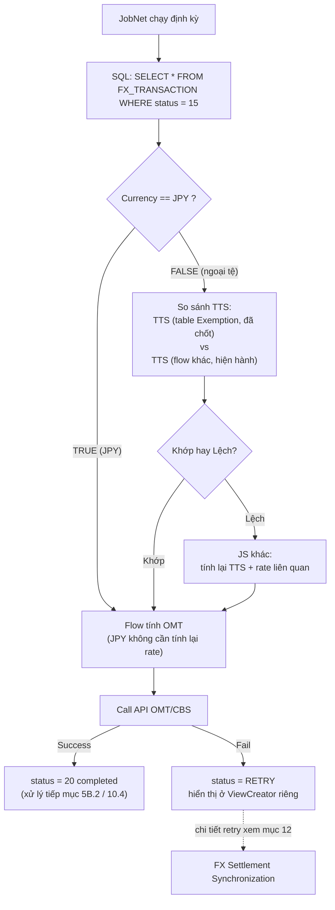
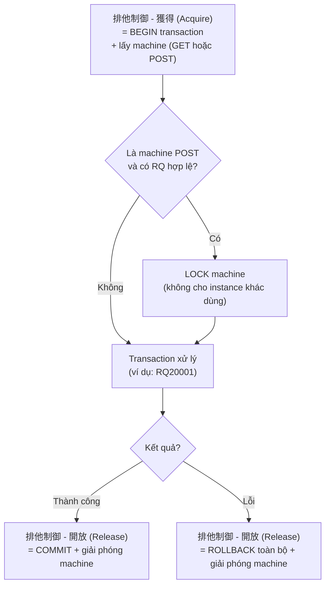

## Tenpo (店舗) — Lớp kiểm soát tại chi nhánh

### Bối cảnh lịch sử

`店舗 (Tenpo)` nghĩa đen = chi nhánh/quầy giao dịch vật lý. Trước đây (kiến trúc gốc/đơn giản) hệ thống chỉ có 2 tầng:

```text
WebShokin → BizForex
```

**Vấn đề của luồng cũ:** không có bước xác nhận ở chi nhánh; teller có thể nhập sai tỷ giá hoặc thông tin khách hàng không hợp lệ; BizForex (back office) nhận dữ liệu lỗi phải rollback hoặc xử lý thủ công.

Sau này (khoảng 2015–2020, theo mô hình `業務分掌` — phân tách trách nhiệm nghiệp vụ Nhật), ngân hàng bổ sung Tenpo làm tầng trung gian:

```text
WebShokin → Tenpo → BizForex
```

### Bảng 3 tầng vai trò

| Channel | Người sử dụng | Môi trường | Chức năng chính |
|---|---|---|---|
| WebShokin | Teller | Web/Intranet | Nhập lệnh, gửi yêu cầu |
| Tenpo | Branch Manager | Local LAN/Terminal | Xác nhận, phê duyệt, điều chỉnh |
| BizForex | Accountant/kế toán | HQ/Data Center | Ghi sổ kế toán, tính rate |

### Quy trình chi tiết

```text
Step 1 — WebShokin: Teller nhập giao dịch → status = 10 (tạm nhập)
Step 2 — Tenpo: kiểm tra KH, loại tiền, tỷ giá, KYC/AML
         → OK: 承認 (Approve) → status = 20 → gửi BizForex
         → NG: 差戻し (Reject) → trả về WebShokin
Step 3 — BizForex: nhận record đã approved → gọi API CBS
         → ghi sổ (denpyo/tanpyo) → status = 30 (Completed)
```

### Status theo channel (ví dụ)

| Status Code | Channel | Ý nghĩa |
|---|---|---|
| 10 | WebShokin | Teller nhập lệnh, chờ xác nhận |
| 15 | WebShokin | Đã gửi sang Tenpo |
| 20 | Tenpo | Đã kiểm tra, phê duyệt |
| 25 | Tenpo | Gửi sang BizForex |
| 30 | BizForex | Đã ghi sổ kế toán thành công |
| 40 | BizForex | Sinh report hoàn tất |

### Bảy vai trò nghiệp vụ chính của Tenpo

| Vai trò | Mô tả |
|---|---|
| Validation | Kiểm tra KH, loại tiền, quốc gia, reason code |
| Approval | Duyệt giao dịch thay mặt Branch Manager |
| Adjustment | Chỉnh lại rate/amount trước khi gửi BizForex nếu cần |
| AML/KYC control | Kiểm tra danh sách đen, giới hạn chuyển tiền, mục đích sử dụng |
| Exception handling | Xử lý thủ công khi batch lỗi/file sai format |
| Value Date confirmation | Xác nhận ngày hiệu lực trước khi ghi sổ |
| Cầu nối BizForex | Chỉ gửi giao dịch "đã confirm" sang BizForex |

### Code minh họa

**DB schema:**
```sql
ALTER TABLE FX_TRANSACTION
  ADD COLUMN CHANNEL VARCHAR(10),
  ADD COLUMN STATUS VARCHAR(5),
  ADD COLUMN APPROVED_BY VARCHAR(20),
  ADD COLUMN APPROVED_DATE TIMESTAMP;
```

**Java phân role:**
```java
if (role.equals("TELLER")) {
    transactionService.saveTransaction(request);
    transaction.setStatus("10");
} else if (role.equals("BRANCH_MANAGER")) {
    transactionService.approveTransaction(id, user);
    transaction.setStatus("20");
} else if (role.equals("ACCOUNTANT")) {
    transactionService.postToAccounting(id);
    transaction.setStatus("30");
}
```

**JSP ẩn/hiện nút theo channel:**
```jsp
<c:if test="${channel == 'WEBSHOKIN'}"><button>送金実行</button></c:if>
<c:if test="${channel == 'TENPO'}">
  <button>承認</button>
  <button>修正</button>
</c:if>
<c:if test="${channel == 'BIZFOREX'}">
  <button>伝票作成</button>
  <button>完了</button>
</c:if>
```

**Ví dụ log thực tế (timeline):**
```text
[09:15:12] WebShokin: Created TXN=FX20251030001 (rate=28000)
[09:16:05] Tenpo: Approved TXN=FX20251030001 (rate=28000)
[09:17:40] BizForex: Posted TXN=FX20251030001 (book_rate=27800, gain=2000000)
```

### Lý do nghiệp vụ + compliance

- Kiểm soát nội bộ tốt hơn, tránh teller gửi nhầm/vượt hạn mức.
- Phân quyền rõ: nhập (Web) – duyệt (Tenpo) – hạch toán (Biz).
- Tuân thủ **JFSA** (Financial Services Agency – Nhật Bản) về kiểm soát ngoại tệ.
- Giảm lỗi kế toán vì BizForex chỉ nhận giao dịch đã duyệt.

---


## Kanryo (完了) — Chi tiết kỹ thuật và job tự động

### Ba pha của FX module

| Giai đoạn | Tiếng Nhật | Mục đích | Ai thực hiện |
|---|---|---|---|
| Nhập liệu | 入力 | Nhập record giao dịch (mua/bán, tỷ giá, số lượng, TTS, exemption) | Thu ngân/nhân viên FX |
| Xử lý tạm thời | 一時処理 | Tính toán tạm: exemption rate, tổng tiền, status = 10 (in progress) | Hệ thống tự xử lý khi nhấn "Tính toán" |
| Hoàn tất | 完了 (Kanryo) | Gửi lệnh thật tới OMT/CBS | User nhấn nút hoặc job chạy định kỳ |

### Khi nhấn nút Kanryo

```text
POST /api/forex/completeTransaction
```

> **Đã điều chỉnh:** bước này set `status = 15` (đã Kanryo, sẵn sàng xử lý) — **không gọi OMT ngay lập tức**. Việc gọi OMT/CBS thực sự diễn ra bất đồng bộ qua JobNet (xem mục 5D). Các bước 1-5 dưới đây mô tả logic validate + gọi OMT nói chung, được **JobNet** thực thi khi nhặt record status=15, không phải chạy ngay khi API completeTransaction được gọi.

1. Lấy danh sách giao dịch có status = 10 hoặc 15 tùy bước (xem mục 5D để biết chính xác thời điểm).
2. Với mỗi giao dịch, validate:
   - ✅ đủ dữ liệu (currency pair, rate, amount)
   - ✅ chưa gửi tới OMT trước đó (tránh gửi trùng)
   - ✅ role người dùng hợp lệ (manager)
3. Sinh transaction message theo format OMT/CBS (Header: mã giao dịch, ngày giờ, user ID, branch code; Body: danh sách detail).
4. Gọi OMT API (SOAP/XML hoặc REST/XML).
5. Kết quả: thành công → status = 20 (completed); lỗi → status = RETRY (xem mục 5D.1, 12 để biết chi tiết flow retry).

### Job tự động nếu user không nhấn Kanryo

Batch/cshell job chạy định kỳ (ví dụ mỗi giờ, hoặc cố định `00:00, 06:00, 12:00`):

```bash
0 * * * * /usr/local/bin/omt_forex_job.sh
```

```bash
curl -X POST http://localhost:8080/api/forex/autoComplete
```

Service tìm record `status = 10 AND updated_time < now() - 30min`, lặp lại đúng logic validate → gọi OMT → update status → ghi log, giống hệt khi nhấn Kanryo thủ công.

> **Phân biệt quan trọng:** job auto-complete này (tự động **gửi** giao dịch pending nếu user quên Kanryo) khác với BankSyncJob ở mục 12.4 (polling để **lấy kết quả** của giao dịch đã gửi trước đó). Hai job phục vụ hai mục đích khác nhau trong cùng vòng đời giao dịch.

### Response code cụ thể từ OMT

```text
Mã kết quả: 0000 = OK, 9999 = lỗi
OMT-Trx-No: số transaction OMT
Trạng thái từng record: success / fail / skip
```

### Cơ chế bảo vệ (bổ sung cho Idempotency ở mục 13.2)

- **Lock record trước khi xử lý** — tránh double send (khác với việc chỉ kiểm tra Transaction ID ở phía CBS; đây là khóa ở tầng record trong hệ thống gửi).
- Gắn `traceId` duy nhất cho mỗi transaction.
- Log toàn bộ input/output của OMT vào bảng `omt_transaction_log`.
- Cập nhật trạng thái bằng batch log file để đảm bảo audit.

### Lý do thiết kế song song "Kanryo + Job định kỳ"

Đảm bảo giao dịch không bị bỏ sót nếu user quên thao tác; cho phép auto-closing cuối ngày; job cũng dùng để retry lỗi tạm thời (network, timeout).

---


## JobNet — Xử lý batch cho receipt đã Kanryo (status = 15)

> Bổ sung/điều chỉnh quan trọng so với mục 5B.2: việc nhấn Kanryo trên màn hình **KHÔNG gọi OMT/CBS ngay lập tức (đồng bộ)**. Nhấn Kanryo chỉ set `status = 15` (đã hoàn tất nhập liệu, sẵn sàng xử lý). Việc gọi OMT/CBS thực sự diễn ra **bất đồng bộ**, thông qua 1 job chạy định kỳ gọi là **JobNet**.

### Luồng tổng quan



Diễn giải bằng chữ (tương đương sơ đồ trên):

```text
JobNet chạy định kỳ → SELECT status = 15
   → check Currency == JPY?
        TRUE  → đi thẳng vào Flow tính OMT
        FALSE → so sánh TTS (Exemption table vs flow khác)
                  Khớp → đi thẳng vào Flow tính OMT
                  Lệch → tính lại TTS/rate → rồi vào Flow tính OMT
   → Call API OMT/CBS
        Success → status = 20 (completed)
        Fail    → status = RETRY → ViewCreator riêng (xem mục 12)
```

### Điểm mấu chốt cần nhớ

- **JPY luôn đi thẳng** — không cần bước so sánh TTS, vì nội tệ không cần quy đổi tỷ giá.
- **Ngoại tệ bắt buộc so sánh 2 nguồn TTS** trước khi gọi OMT:
  - TTS đã lưu trong table Exemption (chốt tại thời điểm user nhập liệu/Kanryo).
  - TTS lấy mới nhất từ 1 flow khác (rate hiện hành tại thời điểm JobNet chạy).
  - Nếu **khớp** → rate còn hợp lệ, xử lý bình thường.
  - Nếu **lệch** → rate đã đổi giữa lúc user nhập và lúc JobNet chạy → phải tính lại TTS/rate liên quan trước khi gọi OMT.
- Bước so sánh này về bản chất chính là ứng dụng thực tế của khái niệm **Historical rate (chốt lúc giao dịch) vs Current rate (hiện hành)** đã nêu ở mục 9 — nhưng áp dụng ngay tại bước tiền xử lý trước khi gọi OMT, chứ không chỉ dùng cho revaluation cuối tháng.

### 排他制御 (Haita Seigyo) — Acquire/Release machine + transaction boundary

> Khái niệm kỹ thuật chuẩn của mainframe/COBOL (không riêng CBS) — đã kiểm chứng qua tài liệu chính thức Hitachi và chuẩn COBOL2002. Đây là cơ chế bao quanh mỗi lần gọi transaction (ví dụ RQ20001) tới OMT/CBS.

**Cặp thuật ngữ chuẩn:** 獲得 (Kakutoku — Acquire) và 開放 (Kaihou — Release), thuộc cơ chế 排他制御 (Exclusive Control — kiểm soát truy cập độc quyền vào tài nguyên, ở đây là "machine"/terminal xử lý).



**Điểm mấu chốt:** **Commit nằm trong bước 開放 (Release)**, **Begin nằm trong bước 獲得 (Acquire)** — không tách rời thành các bước riêng biệt như trong mô hình transaction quen thuộc (BEGIN...COMMIT/ROLLBACK...). Dù thành công hay lỗi, machine đều được giải phóng ở cùng 1 điểm cuối (Release) — chỉ khác là đi kèm Commit hay Rollback bên trong bước đó.

> Đây là ứng dụng cụ thể của nguyên tắc rollback đã nêu ở mục 13.1 (transaction boundary, không undo được external call đã thành công) — nhưng ở tầng thấp hơn: quản lý vòng đời của chính "machine" (terminal/kết nối) dùng để gọi transaction, không chỉ quản lý dữ liệu DB.

---

