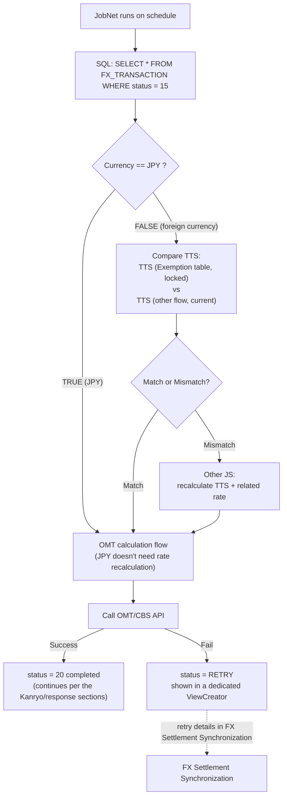
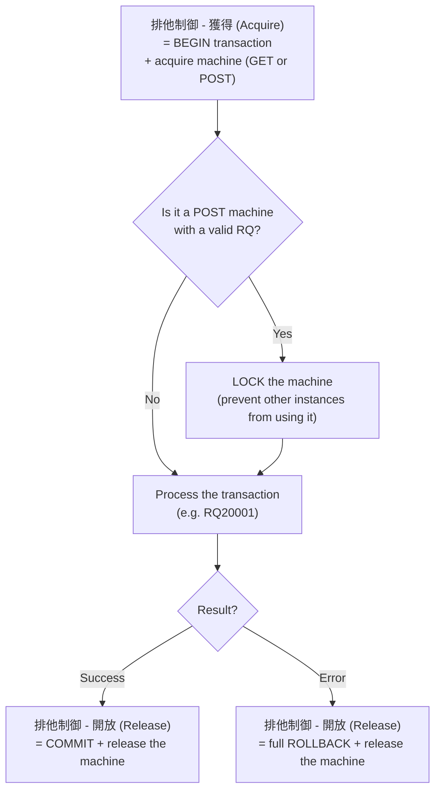

## Tenpo (店舗) — the branch control layer

### Historical background

`店舗 (Tenpo)` literally means branch/physical transaction counter. Previously (original/simpler architecture), the system only had 2 tiers:

```text
WebShokin → BizForex
```

**Problem with the old flow:** there was no confirmation step at the branch; a teller could enter the wrong rate or invalid customer information; BizForex (back office) receiving bad data had to roll back or handle it manually.

Later (around 2015–2020, following the `業務分掌` model — Japanese business-responsibility segregation), the bank added Tenpo as an intermediate tier:

```text
WebShokin → Tenpo → BizForex
```

### Three-tier role table

| Channel | User | Environment | Main function |
|---|---|---|---|
| WebShokin | Teller | Web/Intranet | Order entry, submit requests |
| Tenpo | Branch Manager | Local LAN/Terminal | Confirm, approve, adjust |
| BizForex | Accountant | HQ/Data Center | Post accounting entries, calculate rate |

### Detailed process

```text
Step 1 — WebShokin: Teller enters transaction → status = 10 (draft)
Step 2 — Tenpo: checks customer, currency, rate, KYC/AML
         → OK: 承認 (Approve) → status = 20 → send to BizForex
         → NG: 差戻し (Reject) → sent back to WebShokin
Step 3 — BizForex: receives the approved record → calls the CBS API
         → posts entries (denpyo/tanpyo) → status = 30 (Completed)
```

### Status by channel (example)

| Status Code | Channel | Meaning |
|---|---|---|
| 10 | WebShokin | Teller entered order, awaiting confirmation |
| 15 | WebShokin | Sent to Tenpo |
| 20 | Tenpo | Checked, approved |
| 25 | Tenpo | Sent to BizForex |
| 30 | BizForex | Accounting entry posted successfully |
| 40 | BizForex | Report generation complete |

### Tenpo's seven core business roles

| Role | Description |
|---|---|
| Validation | Check customer, currency, country, reason code |
| Approval | Approve the transaction on behalf of the Branch Manager |
| Adjustment | Adjust rate/amount before sending to BizForex if needed |
| AML/KYC control | Check blacklists, remittance limits, purpose of use |
| Exception handling | Manually handle batch errors/malformed files |
| Value Date confirmation | Confirm the effective date before posting |
| Bridge to BizForex | Only send "confirmed" transactions to BizForex |

### Illustrative code

**DB schema:**
```sql
ALTER TABLE FX_TRANSACTION
  ADD COLUMN CHANNEL VARCHAR(10),
  ADD COLUMN STATUS VARCHAR(5),
  ADD COLUMN APPROVED_BY VARCHAR(20),
  ADD COLUMN APPROVED_DATE TIMESTAMP;
```

**Role branching in Java:**
```java
if (role.equals("TELLER")) {
    transactionService.saveTransaction(request);
    transaction.setStatus("10");
} else if (role.equals("BRANCH_MANAGER")) {
    transactionService.approveTransaction(id, user);
    transaction.setStatus("20");
} else if (role.equals("ACCOUNTANT")) {
    transactionService.postToAccounting(id);
    transaction.setStatus("30");
}
```

**JSP button visibility by channel:**
```jsp
<c:if test="${channel == 'WEBSHOKIN'}"><button>送金実行</button></c:if>
<c:if test="${channel == 'TENPO'}">
  <button>承認</button>
  <button>修正</button>
</c:if>
<c:if test="${channel == 'BIZFOREX'}">
  <button>伝票作成</button>
  <button>完了</button>
</c:if>
```

**Example real log (timeline):**
```text
[09:15:12] WebShokin: Created TXN=FX20251030001 (rate=28000)
[09:16:05] Tenpo: Approved TXN=FX20251030001 (rate=28000)
[09:17:40] BizForex: Posted TXN=FX20251030001 (book_rate=27800, gain=2000000)
```

### Business rationale + compliance

- Better internal control, prevents tellers from sending erroneous transactions or exceeding limits.
- Clear separation of duties: entry (Web) – approval (Tenpo) – posting (Biz).
- Compliance with **JFSA** (Financial Services Agency – Japan) foreign-exchange controls.
- Reduces accounting errors since BizForex only receives approved transactions.

---


## Kanryo (完了) — technical details and the automated job

### The three phases of the FX module

| Phase | Japanese | Purpose | Who performs it |
|---|---|---|---|
| Data entry | 入力 | Enter the transaction record (buy/sell, rate, amount, TTS, exemption) | Teller/FX staff |
| Temporary processing | 一時処理 | Provisional calculation: exemption rate, total amount, status = 10 (in progress) | System auto-processes on "Calculate" |
| Completion | 完了 (Kanryo) | Send the real order to OMT/CBS | User clicks the button, or a scheduled job |

### When the Kanryo button is clicked

```text
POST /api/forex/completeTransaction
```

> **Corrected:** this step sets `status = 15` (Kanryo done, ready for processing) — **it does NOT call OMT immediately**. The actual OMT/CBS call happens asynchronously via JobNet (see the JobNet section below). Steps 1-5 below describe the validate + call-OMT logic in general, executed by **JobNet** when it picks up status=15 records — not run immediately when the completeTransaction API is called.

1. Fetch the list of transactions with status = 10 or 15 depending on the step (see the JobNet section for exact timing).
2. For each transaction, validate:
   - ✅ data completeness (currency pair, rate, amount)
   - ✅ not already sent to OMT before (avoid duplicate sends)
   - ✅ valid user role (manager)
3. Generate the transaction message per the OMT/CBS format (Header: transaction code, date/time, user ID, branch code; Body: detail list).
4. Call the OMT API (SOAP/XML or REST/XML).
5. Result: success → status = 20 (completed); failure → status = RETRY (see the JobNet and FX Settlement Synchronization sections for retry flow details).

### Automatic job if the user doesn't click Kanryo

Batch/cshell job running on a schedule (e.g. every hour, or fixed at `00:00, 06:00, 12:00`):

```bash
0 * * * * /usr/local/bin/omt_forex_job.sh
```

```bash
curl -X POST http://localhost:8080/api/forex/autoComplete
```

The service looks for records with `status = 10 AND updated_time < now() - 30min`, repeats the exact validate → call OMT → update status → log logic, same as manually clicking Kanryo.

> **Important distinction:** this auto-complete job (automatically **sending** pending transactions if the user forgot to click Kanryo) is different from the BankSyncJob (polling to **fetch results** of transactions already sent — see the FX Settlement Synchronization chapter). Two jobs serving two different purposes in the same transaction lifecycle.

### Specific OMT response codes

```text
Result code: 0000 = OK, 9999 = error
OMT-Trx-No: OMT transaction number
Per-record status: success / fail / skip
```

### Protection mechanism (in addition to Idempotency, see the Design Principles chapter)

- **Lock the record before processing** — prevents double send (different from just checking the Transaction ID on the CBS side; this is a lock at the record level in the sending system).
- Attach a unique `traceId` to every transaction.
- Log the full OMT input/output to the `omt_transaction_log` table.
- Update status via batch log file to ensure audit.

### Rationale for the parallel "Kanryo + scheduled job" design

Ensures no transaction is missed if the user forgets to act; enables auto-closing at end of day; the job is also used to retry transient errors (network, timeout).

---


## JobNet — batch processing for receipts already Kanryo'd (status = 15)

> An important addition/correction: clicking Kanryo on the screen does **NOT call OMT/CBS immediately (synchronously)**. Clicking Kanryo only sets `status = 15` (data entry complete, ready for processing). The actual OMT/CBS call happens **asynchronously**, via a scheduled job called **JobNet**.

### Overall flow



Textual equivalent of the diagram above:

```text
JobNet runs on schedule → SELECT status = 15
   → check Currency == JPY?
        TRUE  → go straight into the OMT calculation flow
        FALSE → compare TTS (Exemption table vs other flow)
                  Match    → go straight into the OMT calculation flow
                  Mismatch → recalculate TTS/rate → then into the OMT calculation flow
   → Call OMT/CBS API
        Success → status = 20 (completed)
        Fail    → status = RETRY → dedicated ViewCreator (see FX Settlement Synchronization)
```

### Key points to remember

- **JPY always goes straight through** — no need for the TTS comparison step, since the local currency doesn't need rate conversion.
- **Foreign currency must compare 2 TTS sources** before calling OMT:
  - TTS stored in the Exemption table (locked at the time the user entered data/clicked Kanryo).
  - TTS freshly fetched from another flow (the current rate at the time JobNet runs).
  - If they **match** → the rate is still valid, process normally.
  - If they **mismatch** → the rate changed between when the user entered it and when JobNet ran → the related TTS/rate must be recalculated before calling OMT.
- This comparison step is, in essence, a real-world application of the **Historical rate (locked at transaction time) vs Current rate (prevailing)** concept covered in the BizForex chapter — but applied right at the pre-processing step before calling OMT, not only used for end-of-month revaluation.

### 排他制御 (Haita Seigyo) — Acquire/Release machine + transaction boundary

> A standard mainframe/COBOL technical concept (not specific to CBS) — verified against official Hitachi documentation and the COBOL2002 standard. This is the mechanism wrapping every transaction call (e.g. RQ20001) to OMT/CBS.

**Standard term pair:** 獲得 (Kakutoku — Acquire) and 開放 (Kaihou — Release), part of the 排他制御 (Exclusive Control) mechanism — exclusive access control over a resource, here the processing "machine"/terminal.



**Key point:** **Commit lives inside the 開放 (Release) step**, **Begin lives inside the 獲得 (Acquire) step** — they are not split into separate steps like the familiar transaction model (BEGIN...COMMIT/ROLLBACK...). Whether success or failure, the machine is always released at the same final point (Release) — the only difference is whether a Commit or a Rollback happens inside that step.

> This is a concrete application of the rollback principle covered in the Design Principles chapter (transaction boundary, cannot undo an external call that already succeeded) — but at a lower layer: managing the lifecycle of the "machine" (terminal/connection) itself used to call the transaction, not just managing DB data.

---

