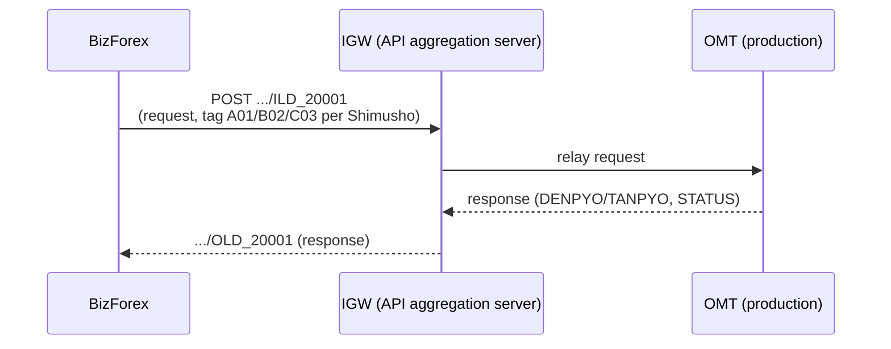
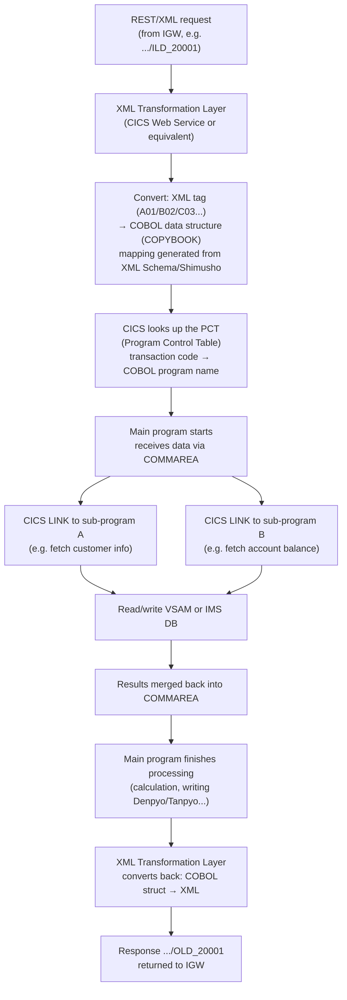

## Denpyo and Tanpyo — technical details

### Concept

| Japanese term | Kanji | Meaning | Purpose |
|---|---|---|---|
| Denpyo | 伝票 | Voucher, overall document | Represents one complete financial transaction, containing multiple sub-entries |
| Tanpyo | 単票 | Single entry | Represents each individual accounting line (debit/credit) within a denpyo |

1 denpyo = N tanpyo (a transaction may produce 2–10 tanpyo). Don't assume a denpyo always has exactly 2 tanpyo — the structure depends on the accounting design.

### Example data table

| DenpyoNo | TanpyoNo | Debit | Credit | Amount | Currency |
|---|---|---|---|---|---|
| D20251030001 | T1 | Cash(1111) | Foreign Exchange(2110) | 100,000,000 | VND |
| D20251030001 | T2 | FX Gain(5310) | Revaluation(4310) | 2,000,000 | VND |
| D20251030002 | T1 | Cash(1111) | Foreign Exchange(2110) | 200,000,000 | VND |

### XML call to CBS — Request

> **Note:** this is an illustrative example for readability (the header is split into sub-tags). The real HEADER format is different — see the IGW/ILD/OLD section below for the exact structure (HEADER is a raw, fixed-length character string, not separate XML tags).

```xml
<HEADER>
  <BANKCODE>001</BANKCODE>
  <TRANSCODE>20001</TRANSCODE>
  <MACHINENO>002</MACHINENO>
</HEADER>
<BODY>
  <DENPYO>
    <DENPYO_NO>D20251030001</DENPYO_NO>
    <TANPYO_LIST>
      <TANPYO><SEQ>1</SEQ><DEBIT_ACC>1111</DEBIT_ACC><CREDIT_ACC>2110</CREDIT_ACC><AMOUNT>100000000</AMOUNT></TANPYO>
      <TANPYO><SEQ>2</SEQ><DEBIT_ACC>5310</DEBIT_ACC><CREDIT_ACC>4310</CREDIT_ACC><AMOUNT>2000000</AMOUNT></TANPYO>
    </TANPYO_LIST>
  </DENPYO>
</BODY>
```

### XML response from CBS

```xml
<RESPONSE>
  <DENPYO>
    <DENPYO_NO>D20251030001</DENPYO_NO>
    <STATUS>SUCCESS</STATUS>
    <TANPYO_LIST>
      <TANPYO><SEQ>1</SEQ><RESULT>OK</RESULT></TANPYO>
      <TANPYO><SEQ>2</SEQ><RESULT>OK</RESULT></TANPYO>
    </TANPYO_LIST>
  </DENPYO>
</RESPONSE>
```

After that: `STATUS = Completed`, log the posting time + transaction ID from CBS.

### ⚠️ Note: the Denpyo/Tanpyo hierarchy is NOT consistent across sources

This document (Concept section above) describes **Denpyo = overall document, Tanpyo = sub-entries** (1 Denpyo contains N Tanpyo). However, another source describes it **the other way around**: Tanpyo (単票) = the overall transaction slip, Denpyo (伝票) = the specific detailed debit/credit entry (1 Tanpyo contains N Denpyo), with this response structure:

```xml
<Response>
  <Tanpyo>
    <TanpyoNo>TX20251029001</TanpyoNo>
    <Status>SUCCESS</Status>
    <TotalAmount>2000</TotalAmount>
    <DenpyoList>
      <Denpyo><DenpyoNo>TX20251029001-1</DenpyoNo><Account>123456</Account><Debit>1000</Debit><Credit>0</Credit></Denpyo>
      <Denpyo><DenpyoNo>TX20251029001-2</DenpyoNo><Account>654321</Account><Debit>0</Debit><Credit>1000</Credit></Denpyo>
    </DenpyoList>
  </Tanpyo>
</Response>
```

The JAXB parser code matching this interpretation:

```java
@XmlRootElement(name = "Response")
public class CBSResponse {
    private Tanpyo tanpyo;
}
public class Tanpyo {
    private String tanpyoNo;
    private String status;
    private List<Denpyo> denpyoList;
}
public class Denpyo {
    private String denpyoNo;
    private String account;
    private BigDecimal debit;
    private BigDecimal credit;
}
```

> **Both interpretations are linguistically reasonable and both appear in practice** (depending on the specific CBS system / core-banking vendor). There is no single absolute standard. **When working with a real system, confirm that system's own convention** rather than assuming based on a single source — this itself is worth mentioning in an interview, showing carefulness rather than a wrong assertion.

### Common difficulties

| Issue | Explanation |
|---|---|
| Complex XML mapping | Nested denpyo-tanpyo structure requires a precise parser |
| Wrong rate/account mapping | Rejected by CBS if the entry is posted incorrectly |
| Job timeout | Scheduled batch jobs can fail due to network issues, needs retry logic |
| Authorization | Only a Manager can transition status 12→10 |
| Reconciliation | Logs must be cross-checked between the system and CBS |

---


## Dynamic XML Builder (fixed header + body per transaction code)

### Business model

- **Header:** always fixed — `bankCode`, `transactionCode`, `machineNo`.
- **Body:** configured dynamically per transaction type. E.g. `20001` uses `<customerName>`, `20002` uses `<customerNumber>`, `<currency>`.
- The body template is stored in the DB, abstract field keys (`a1`, `a2`...) map to real XML tag names.

### Main classes

```java
// Model storing the field mapping from DB
public class XmlTemplate {
    private String transactionCode;
    private String rootElement;
    private Map<String, String> fieldMappings; // {"a1": "customerName", "a2": "customerKana"}
    // getter/setter...
}
```

```java
// Service that fetches the config for a given transactionCode
public class XmlTemplateService {
    public XmlTemplate getTemplateByCode(String transactionCode) {
        XmlTemplate template = new XmlTemplate();
        template.setTransactionCode(transactionCode);
        template.setRootElement("paymentRequest");
        Map<String, String> fields = new HashMap<>();
        if ("20001".equals(transactionCode)) {
            fields.put("a1", "customerName");
            fields.put("a2", "customerKana");
        } else if ("20002".equals(transactionCode)) {
            fields.put("a1", "customerNumber");
            fields.put("a2", "currency");
        }
        template.setFieldMappings(fields);
        return template;
    }
}
```

```java
// Helper that builds the full XML
public class XmlBuilderHelper {
    public static String buildXml(String bankCode, String transactionCode, String machineNo,
            Map<String, String> dataMap, XmlTemplate template) {
        StringBuilder xml = new StringBuilder();
        xml.append("<request><header>")
           .append("<bankCode>").append(bankCode).append("</bankCode>")
           .append("<transactionCode>").append(transactionCode).append("</transactionCode>")
           .append("<machineNo>").append(machineNo).append("</machineNo>")
           .append("</header><body>");
        for (Map.Entry<String, String> entry : template.getFieldMappings().entrySet()) {
            String xmlTag = entry.getValue();
            String value = dataMap.getOrDefault(entry.getKey(), "");
            xml.append("<").append(xmlTag).append(">")
               .append(escapeXml(value))
               .append("</").append(xmlTag).append(">");
        }
        xml.append("</body></request>");
        return xml.toString();
    }

    private static String escapeXml(String value) {
        if (value == null) return "";
        return value.replace("&", "&amp;").replace("<", "&lt;")
                    .replace(">", "&gt;").replace("\"", "&quot;").replace("'", "&apos;");
    }
}
```

### Example output

```xml
<request>
  <header>
    <bankCode>001</bankCode>
    <transactionCode>20001</transactionCode>
    <machineNo>MACH123</machineNo>
  </header>
  <body>
    <customerName>Nguyen Van A</customerName>
    <customerKana>グエン ヴァン アー</customerKana>
  </body>
</request>
```

### Design advantages

| Advantage | Description |
|---|---|
| Highly reusable | XmlBuilderHelper is shared across every service |
| Easy to extend | Adding a new transaction only needs a DB template config |
| Separates business logic & XML | No hardcoded XML in code |
| Optimized for debug/log | Both the template and actual values are logged for tracing |

### IGW — the intermediary server, ILD/OLD naming convention

> Important addition: BizForex **does not call CBS directly**. There's an intermediary tier called **IGW** — a separate server whose only job is to **aggregate APIs**. The OMT side (the production system that actually processes transactions) is called **through IGW**, not directly by BizForex calling OMT/CBS.

**The correct flow:**


**Endpoint naming convention per transaction code:**

```text
.../ILD_20001   ← Input  Layout Data for transaction code 20001
.../OLD_20001   ← Output Layout Data for transaction code 20001
```

- **ILD (Input Layout Data)** — defines the structure of the **outbound request** for a specific transaction code. OMT specifies which field (e.g. customer number, account number) maps to which XML tag — e.g. `customer number → A02`, `account number → B01`. Tag names **are abstract symbols (A02, B01...)**, not human-readable field names.
- **OLD (Output Layout Data)** — similar, but for the **returned response**, also using abstract-symbol XML tags.
- **仕様書 file (Shimusho — spec document)** — the design reference document used to look up exactly **which XML tag maps to which business field** (e.g. A02 = customer number). The tag's meaning can't be guessed from the XML alone — the shimusho must be consulted.

> This is real-world confirmation of the exact pattern noted in the Dynamic XML Builder section above (an XML Builder with abstract field keys `a1, a2` mapping to real tags via config) — the only difference is that the real tags take the form `A01, B02, C03...` (letter + number) instead of `a1, a2`, and this mapping table is precisely the **Shimusho file**, not just a self-built DB table like the earlier illustrative example.

**Example of the real request/response structure (different from the illustrative example above — note the HEADER here is a raw, fixed-length character string, NOT XML sub-tags like `<BANKCODE>`/`<TRANSCODE>` shown earlier):**

```xml
<HEADER>
  0010176002......
</HEADER>
<BODY>
  <A01>ten</A01>
  <B02>ka</B02>
  <C03>ko</C03>
</BODY>
```

```xml
<RESPONSE>
  <DENPYO>
    <DENPYO_NO>D20251030001</DENPYO_NO>
    <STATUS>SUCCESS</STATUS>
    <TANPYO_LIST>
      <TANPYO><SEQ>1</SEQ><RESULT>OK</RESULT></TANPYO>
      <TANPYO><SEQ>2</SEQ><RESULT>OK</RESULT></TANPYO>
    </TANPYO_LIST>
  </DENPYO>
</RESPONSE>
```

> **Correction versus the earlier example:** the example `<HEADER><BANKCODE>001</BANKCODE><TRANSCODE>20001</TRANSCODE><MACHINENO>002</MACHINENO></HEADER>` shown earlier is an **illustrative simplification for readability**, not the real format. In reality, **HEADER is a single raw, fixed-length character string** (fixed-length string style, e.g. `0010176002......`), similar to how fields are encoded by offset as described in the HULFT File Parsing chapter (parsed by byte/position), not separate XML sub-tags like BANKCODE/TRANSCODE. Only the **BODY** is in XML tag form (and uses abstract tags A01/B02/C03 per the shimusho, not readable field names).

> This is the mirror image of the parsing described in the HULFT File Parsing chapter: one side reads a fixed-length file in (using a DB layout to cut bytes), the other builds outbound XML (using a DB template/shimusho to build tags) — both following the same **data-driven, configuration-outside-code** philosophy.

---


## Inside the COBOL layer (industry-standard architecture — reference only, not confirmed specifically for CBS)

> **Scope note:** this section describes **standard mainframe/COBOL industry architecture** (per official IBM CICS, Micro Focus documentation, the COBOL2002 standard) — applicable generally to Japanese-style core banking, **not a direct confirmation of how CBS is implemented internally**. Use it as background reference, don't cite it as information verified specifically for Bank ABC's system.

### From XML request to COBOL program



### Notable technical points

1. **The COBOL program has no "awareness" of XML/REST** — it only works with COBOL data structures (COPYBOOK). "Understanding" XML is the responsibility of the XML Transformation Layer sitting in front, where abstract tags (A01/B02/C03) are mapped to real COBOL fields per the Shimusho (仕様書) file.
2. **COMMAREA (Communication Area)** — a memory area used to pass data between COBOL programs via the `CICS LINK` command, unlike modern REST APIs (each call independent) — this is the "thread" running through the entire chain of sub-programs.
3. **1 transaction code = a chain of several small programs** — each program handles one job (fetch customer, fetch balance, post entry...), matching the earlier-noted pattern of calling "multiple RQs" to CBS — each RQ may correspond to one LINK step in the chain.
4. **VSAM/IMS DB** — where the real data is stored (balances, customer info), with a hierarchical structure, unlike relational RDBMS — accessed directly by key, fast but less flexible than SQL.
5. This entire processing chain sits within the **排他制御 - Acquire/Release** framework covered in the JobNet section — Acquire happens before entering the LINK chain, Release (Commit/Rollback) happens after the whole chain completes.

---

