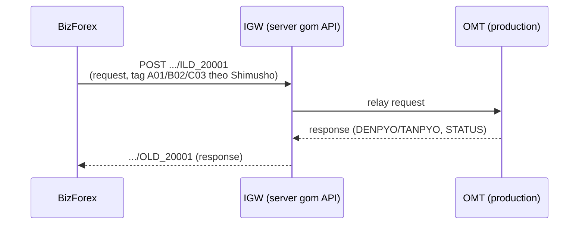
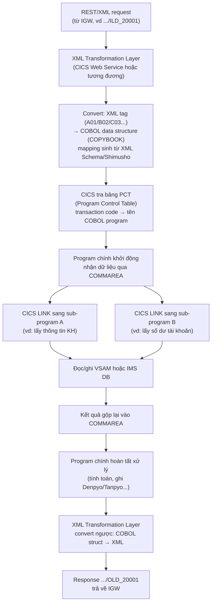

## Denpyo và Tanpyo — chi tiết kỹ thuật

### Khái niệm

| Từ Nhật | Kanji | Nghĩa | Mục đích |
|---|---|---|---|
| Denpyo | 伝票 | Chứng từ, voucher tổng | Đại diện 1 giao dịch tài chính hoàn chỉnh, gồm nhiều bút toán con |
| Tanpyo | 単票 | Chứng từ đơn | Đại diện từng dòng hạch toán (debit/credit) trong denpyo |

1 denpyo = N tanpyo (một giao dịch có thể phát sinh 2–10 tanpyo). Không nên mặc định 1 denpyo luôn có đúng 2 tanpyo — cấu trúc phụ thuộc accounting design.

### Ví dụ bảng dữ liệu

| DenpyoNo | TanpyoNo | Debit | Credit | Amount | Currency |
|---|---|---|---|---|---|
| D20251030001 | T1 | Cash(1111) | Foreign Exchange(2110) | 100,000,000 | VND |
| D20251030001 | T2 | FX Gain(5310) | Revaluation(4310) | 2,000,000 | VND |
| D20251030002 | T1 | Cash(1111) | Foreign Exchange(2110) | 200,000,000 | VND |

### XML gọi CBS — Request

> **Lưu ý:** đây là ví dụ minh họa để dễ đọc (header tách thành các tag con). Format thật của HEADER khác — xem mục 11.5 (IGW, ILD/OLD) để biết cấu trúc chính xác (HEADER là chuỗi ký tự thô cố định độ dài, không phải các tag XML riêng biệt).

```xml
<HEADER>
  <BANKCODE>001</BANKCODE>
  <TRANSCODE>20001</TRANSCODE>
  <MACHINENO>002</MACHINENO>
</HEADER>
<BODY>
  <DENPYO>
    <DENPYO_NO>D20251030001</DENPYO_NO>
    <TANPYO_LIST>
      <TANPYO><SEQ>1</SEQ><DEBIT_ACC>1111</DEBIT_ACC><CREDIT_ACC>2110</CREDIT_ACC><AMOUNT>100000000</AMOUNT></TANPYO>
      <TANPYO><SEQ>2</SEQ><DEBIT_ACC>5310</DEBIT_ACC><CREDIT_ACC>4310</CREDIT_ACC><AMOUNT>2000000</AMOUNT></TANPYO>
    </TANPYO_LIST>
  </DENPYO>
</BODY>
```

### XML response từ CBS

```xml
<RESPONSE>
  <DENPYO>
    <DENPYO_NO>D20251030001</DENPYO_NO>
    <STATUS>SUCCESS</STATUS>
    <TANPYO_LIST>
      <TANPYO><SEQ>1</SEQ><RESULT>OK</RESULT></TANPYO>
      <TANPYO><SEQ>2</SEQ><RESULT>OK</RESULT></TANPYO>
    </TANPYO_LIST>
  </DENPYO>
</RESPONSE>
```

Sau đó: `STATUS = Completed`, log lại thời gian ghi sổ + transaction ID từ CBS.

### ⚠️ Lưu ý: thứ bậc Denpyo/Tanpyo KHÔNG thống nhất giữa các nguồn

Tài liệu này (mục 10.1) mô tả **Denpyo = chứng từ tổng, Tanpyo = bút toán con** (1 Denpyo chứa N Tanpyo). Tuy nhiên có nguồn khác mô tả **ngược lại**: Tanpyo (単票) = phiếu giao dịch tổng, Denpyo (伝票) = bút toán chi tiết nợ/có cụ thể (1 Tanpyo chứa N Denpyo), với cấu trúc response:

```xml
<Response>
  <Tanpyo>
    <TanpyoNo>TX20251029001</TanpyoNo>
    <Status>SUCCESS</Status>
    <TotalAmount>2000</TotalAmount>
    <DenpyoList>
      <Denpyo><DenpyoNo>TX20251029001-1</DenpyoNo><Account>123456</Account><Debit>1000</Debit><Credit>0</Credit></Denpyo>
      <Denpyo><DenpyoNo>TX20251029001-2</DenpyoNo><Account>654321</Account><Debit>0</Debit><Credit>1000</Credit></Denpyo>
    </DenpyoList>
  </Tanpyo>
</Response>
```

Code parser JAXB tương ứng với cách hiểu này:

```java
@XmlRootElement(name = "Response")
public class CBSResponse {
    private Tanpyo tanpyo;
}
public class Tanpyo {
    private String tanpyoNo;
    private String status;
    private List<Denpyo> denpyoList;
}
public class Denpyo {
    private String denpyoNo;
    private String account;
    private BigDecimal debit;
    private BigDecimal credit;
}
```

> **Cả hai cách hiểu đều hợp lý về mặt ngôn ngữ và đều xuất hiện trong thực tế** (tùy hệ thống CBS/các core-banking vendor khác nhau cụ thể). Không có chuẩn thống nhất tuyệt đối. **Khi làm việc với một hệ thống thực tế, nên xác nhận lại quy ước của chính hệ thống đó** thay vì giả định theo 1 nguồn duy nhất — đây bản thân là điểm đáng nói khi phỏng vấn, thể hiện sự cẩn trọng thay vì khẳng định sai.

### Khó khăn thường gặp

| Vấn đề | Giải thích |
|---|---|
| Mapping XML phức tạp | Cấu trúc denpyo-tanpyo lồng nhau, cần parser chính xác |
| Sai tỷ giá/account mapping | Bị CBS reject nếu định khoản sai |
| Job timeout | Job batch gửi định kỳ có thể lỗi mạng, cần retry logic |
| Phân quyền | Chỉ Manager mới chuyển status 12→10 |
| Reconciliation | Phải đối chiếu log giữa hệ thống và CBS |

---


## XML Builder động (header cố định + body theo transaction code)

### Mô hình nghiệp vụ

- **Header:** luôn cố định — `bankCode`, `transactionCode`, `machineNo`.
- **Body:** cấu hình động tùy transaction type. Ví dụ `20001` dùng `<customerName>`, `20002` dùng `<customerNumber>`, `<currency>`.
- Template body lưu trong DB, field key trừu tượng (`a1`, `a2`...) map sang tên tag XML thật.

### Các class chính

```java
// Model lưu mapping field từ DB
public class XmlTemplate {
    private String transactionCode;
    private String rootElement;
    private Map<String, String> fieldMappings; // {"a1": "customerName", "a2": "customerKana"}
    // getter/setter...
}
```

```java
// Service lấy config theo transactionCode
public class XmlTemplateService {
    public XmlTemplate getTemplateByCode(String transactionCode) {
        XmlTemplate template = new XmlTemplate();
        template.setTransactionCode(transactionCode);
        template.setRootElement("paymentRequest");
        Map<String, String> fields = new HashMap<>();
        if ("20001".equals(transactionCode)) {
            fields.put("a1", "customerName");
            fields.put("a2", "customerKana");
        } else if ("20002".equals(transactionCode)) {
            fields.put("a1", "customerNumber");
            fields.put("a2", "currency");
        }
        template.setFieldMappings(fields);
        return template;
    }
}
```

```java
// Helper build XML hoàn chỉnh
public class XmlBuilderHelper {
    public static String buildXml(String bankCode, String transactionCode, String machineNo,
            Map<String, String> dataMap, XmlTemplate template) {
        StringBuilder xml = new StringBuilder();
        xml.append("<request><header>")
           .append("<bankCode>").append(bankCode).append("</bankCode>")
           .append("<transactionCode>").append(transactionCode).append("</transactionCode>")
           .append("<machineNo>").append(machineNo).append("</machineNo>")
           .append("</header><body>");
        for (Map.Entry<String, String> entry : template.getFieldMappings().entrySet()) {
            String xmlTag = entry.getValue();
            String value = dataMap.getOrDefault(entry.getKey(), "");
            xml.append("<").append(xmlTag).append(">")
               .append(escapeXml(value))
               .append("</").append(xmlTag).append(">");
        }
        xml.append("</body></request>");
        return xml.toString();
    }

    private static String escapeXml(String value) {
        if (value == null) return "";
        return value.replace("&", "&amp;").replace("<", "&lt;")
                    .replace(">", "&gt;").replace("\"", "&quot;").replace("'", "&apos;");
    }
}
```

### Output ví dụ

```xml
<request>
  <header>
    <bankCode>001</bankCode>
    <transactionCode>20001</transactionCode>
    <machineNo>MACH123</machineNo>
  </header>
  <body>
    <customerName>Nguyen Van A</customerName>
    <customerKana>グエン ヴァン アー</customerKana>
  </body>
</request>
```

### Ưu điểm thiết kế

| Ưu điểm | Mô tả |
|---|---|
| Tái sử dụng cao | XmlBuilderHelper dùng chung cho mọi service |
| Dễ mở rộng | Thêm giao dịch mới chỉ cần cấu hình template DB |
| Tách biệt nghiệp vụ & XML | Không hardcode XML trong code |
| Tối ưu debug/log | Log được cả template + giá trị thật để trace |

### IGW — server trung gian, quy ước đặt tên ILD/OLD

> Bổ sung quan trọng: BizForex **không gọi thẳng CBS**. Có 1 tầng trung gian gọi là **IGW** — 1 server riêng biệt, chỉ chuyên **gom các API** lại. Bên OMT (hệ thống production thực sự xử lý giao dịch) sẽ gọi **qua IGW**, không phải BizForex gọi trực tiếp OMT/CBS.

**Luồng đúng:**


**Quy ước đặt tên endpoint theo transaction code:**

```text
.../ILD_20001   ← Input  Layout Data cho transaction code 20001
.../OLD_20001   ← Output Layout Data cho transaction code 20001
```

- **ILD (Input Layout Data)** — định nghĩa cấu trúc **request gửi vào** cho 1 transaction code cụ thể. Bên OMT quy định field nào (ví dụ customer number, account number) map vào tag XML nào — ví dụ `customer number → A02`, `account number → B01`. Tên tag **là ký hiệu trừu tượng (A02, B01...)**, không phải tên field dễ đọc.
- **OLD (Output Layout Data)** — tương tự nhưng cho **response trả về**, cũng dùng tag XML dạng ký hiệu trừu tượng.
- **File 仕様書 (Shimusho — tài liệu đặc tả/spec)** — là tài liệu mẫu thiết kế dùng để tra cứu, biết chính xác **tag XML nào map với field nghiệp vụ nào** (ví dụ A02 = customer number). Không thể đoán được ý nghĩa tag chỉ nhìn vào XML, bắt buộc phải tra shimusho.

> Đây chính là bằng chứng thực tế xác nhận lại đúng pattern đã note ở mục 11.1-11.4 (XML Builder với field key trừu tượng `a1, a2` map sang tag thật qua config) — chỉ khác là tag thật trong thực tế có dạng `A01, B02, C03...` (chữ cái + số) thay vì `a1, a2`, và bảng mapping này chính là **file Shimusho**, không chỉ là 1 bảng DB tự dựng như ví dụ minh họa trước.

**Ví dụ cấu trúc request/response thật (khác với ví dụ minh họa ở mục 10.3 — lưu ý HEADER ở đây là chuỗi ký tự thô cố định độ dài, KHÔNG phải các tag XML con như `<BANKCODE>`/`<TRANSCODE>` đã minh họa trước):**

```xml
<HEADER>
  0010176002......
</HEADER>
<BODY>
  <A01>ten</A01>
  <B02>ka</B02>
  <C03>ko</C03>
</BODY>
```

```xml
<RESPONSE>
  <DENPYO>
    <DENPYO_NO>D20251030001</DENPYO_NO>
    <STATUS>SUCCESS</STATUS>
    <TANPYO_LIST>
      <TANPYO><SEQ>1</SEQ><RESULT>OK</RESULT></TANPYO>
      <TANPYO><SEQ>2</SEQ><RESULT>OK</RESULT></TANPYO>
    </TANPYO_LIST>
  </DENPYO>
</RESPONSE>
```

> **Lưu ý sửa lại so với mục 10.3:** ví dụ `<HEADER><BANKCODE>001</BANKCODE><TRANSCODE>20001</TRANSCODE><MACHINENO>002</MACHINENO></HEADER>` ở mục 10.3 là **minh họa để dễ đọc**, không phản ánh đúng format thật. Trong thực tế, **HEADER là 1 chuỗi ký tự thô, độ dài cố định** (kiểu fixed-length string, ví dụ `0010176002......`), giống cách encode field theo offset đã nói ở mục 2 (parse theo byte/vị trí), chứ không phải các tag con XML riêng biệt như BANKCODE/TRANSCODE. Chỉ có phần **BODY mới ở dạng tag XML** (và dùng tag trừu tượng A01/B02/C03 theo shimusho, không phải tên field dễ đọc).

> Đây là mặt đối lập với parsing ở mục 2: một bên đọc file fixed-length vào (dùng layout DB để cắt byte), một bên build XML gửi đi (dùng template DB/shimusho để build tag) — cùng chung triết lý **data-driven, cấu hình bên ngoài code**.

---


## Bên trong tầng COBOL (kiến trúc chuẩn ngành — tham khảo, chưa xác nhận riêng cho CBS)

> **Lưu ý phạm vi:** mục này mô tả kiến trúc **chuẩn ngành mainframe/COBOL** (theo tài liệu chính thức IBM CICS, Micro Focus, chuẩn COBOL2002) — áp dụng chung cho core banking kiểu Nhật, **không phải xác nhận trực tiếp cách CBS implement bên trong**. Dùng để tham khảo/hiểu bối cảnh, không nên trích dẫn như thông tin đã kiểm chứng riêng cho hệ thống Ngân hàng ABC.

### Từ XML request đến COBOL program



### Điểm kỹ thuật đáng chú ý

1. **COBOL program không "biết" gì về XML/REST** — chỉ làm việc với COBOL data structure (COPYBOOK). Việc "hiểu" XML là trách nhiệm của XML Transformation Layer đứng trước, nơi tag trừu tượng (A01/B02/C03) được map vào field COBOL thật theo file Shimusho (仕様書).
2. **COMMAREA (Communication Area)** — vùng bộ nhớ dùng để truyền dữ liệu giữa các COBOL program qua lệnh `CICS LINK`, không giống REST API hiện đại (mỗi lời gọi độc lập) — đây là "sợi dây" xuyên suốt cả chuỗi program con.
3. **1 transaction code = chuỗi nhiều program nhỏ** — mỗi program chuyên 1 việc (lấy KH, lấy số dư, ghi sổ...), khớp với việc gọi "nhiều RQ" tới CBS đã nhớ trước đó — có thể mỗi RQ tương ứng 1 nhịp LINK trong chuỗi.
4. **VSAM/IMS DB** — nơi lưu dữ liệu thật (số dư, thông tin KH), cấu trúc phân cấp (hierarchical), khác RDBMS quan hệ — truy xuất theo key trực tiếp, nhanh nhưng kém linh hoạt hơn SQL.
5. Toàn bộ chuỗi xử lý này nằm trong khuôn khổ **排他制御 - Acquire/Release** đã nêu ở mục 5D.3 — Acquire xảy ra trước khi vào chuỗi LINK, Release (Commit/Rollback) xảy ra sau khi toàn bộ chuỗi hoàn tất.

---

