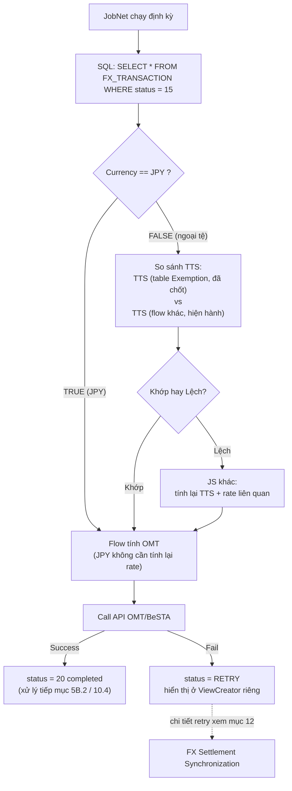
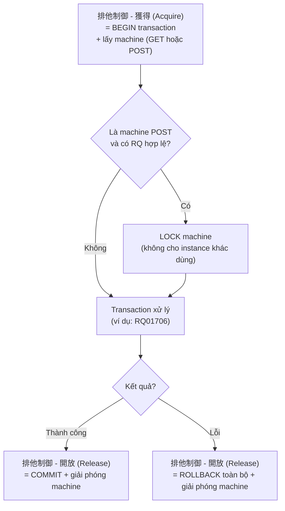
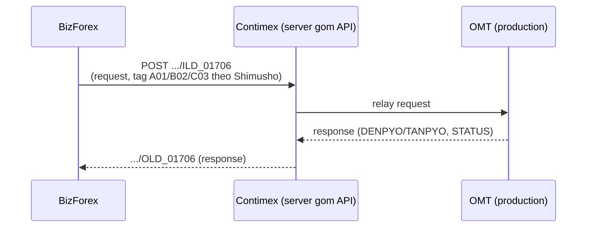
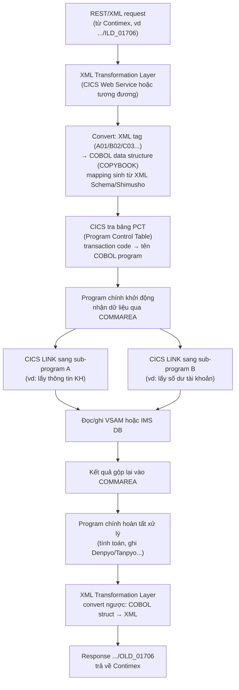

# Tổng hợp chi tiết nghiệp vụ FX: WebShokin – Tenpo – BizForex – BESTA – SWIFT

> Tài liệu tổng hợp từ toàn bộ context đã trao đổi. Đây là mô hình nghiệp vụ suy ra từ các buổi phân tích, không phải tài liệu kiến trúc chính thức của hệ thống thực tế. Số hiệu status, tên field, tên bảng DB trong tài liệu là ví dụ minh họa — hệ thống thực tế có thể đặt tên khác.

---

## 1. Tổng quan toàn bộ hệ thống

```text
External System
      │
    HULFT
      ▼
 Input Batch
      │
      ▼
Parse fixed-length 1400 bytes (theo layout cấu hình DB)
      │
      ▼
     DB
      │
      ▼
ViewCreator
      │
      ▼
WebShokin  (Remittance – front, teller nhập lệnh)
      │
      ▼
Tenpo      (Branch control – review/approval)
      │
      ▼
BizForex   (Exchange – business processing, rate, FX gain/loss)
      │
      ▼
BESTA      (Downstream banking/accounting, Denpyo/Tanpyo)
      │
      ▼
SWIFT Gateway (MT103/MX – nếu là giao dịch quốc tế)
      │
      ▼
Result / Status → BankSync job → Report → Output Batch → HULFT → External System
```

### Vai trò từng thành phần

| Thành phần | Vai trò |
|---|---|
| HULFT | Truyền file giữa các hệ thống (nội địa Nhật) |
| SWIFT | Truyền message tài chính quốc tế giữa các ngân hàng (MT103, MT202, MX ISO20022) |
| Batch | Xử lý file/dữ liệu số lượng lớn |
| Job | Chạy nghiệp vụ định kỳ/tự động (import, sync, retry, reconciliation) |
| Common | Logic/helper dùng chung (parser, date util, HTTP client...) |
| DB | Lưu transaction, status, audit information, rate lịch sử |
| SQL View | Chuẩn bị dữ liệu cho màn hình |
| ViewCreator | Mapping SQL View thành màn hình/list |
| WebShokin | Channel để teller thực hiện giao dịch (Remittance – front) |
| Tenpo | Lớp kiểm soát/review/approval tại branch/store |
| BizForex | Xử lý nghiệp vụ ngoại tệ (Exchange – back, kế toán FX) |
| BESTA | Downstream banking/accounting transaction |
| Report | Sinh báo cáo/kết quả nghiệp vụ |

---

## 2. HULFT → DB: Fixed-length parsing (data-driven layout)

### 2.1 Nguyên tắc cơ bản

File input từ HULFT là **fixed-length record**, ví dụ 1400 byte/record:

```text
1400 bytes = 1 record
Record 1: 1400 bytes
Record 2: 1400 bytes
...
```

### 2.2 Vì sao phải cắt theo BYTE chứ không phải String?

Với hệ thống Nhật, encoding có thể là Shift-JIS (MS932), EUC-JP... Nếu dùng `String.substring()`, vị trí có thể sai khi một ký tự chiếm nhiều byte. Flow an toàn:

```text
InputStream → byte[1400] → offset/length → decode theo encoding → String → DB
```

### 2.3 Cách làm THỰC TẾ: layout không hardcode, quản lý qua DB

Không hardcode offset trong code Java. Layout được lưu trong bảng cấu hình, khi format file đổi chỉ cần sửa DB, không cần sửa code:

**Bảng `FILE_LAYOUT`:**

> **Type codes đã xác nhận theo chuẩn COBOL PIC clause** (không phải ký hiệu tự đặt "N=Numeric/C=Character" như bản nháp minh họa ban đầu):
> - **`9`** = Numeric, không dấu (PIC 9) — chỉ số dương, 1 byte/chữ số.
> - **`S9`** = Signed Numeric, có dấu (PIC S9) — cho phép âm/dương, dùng cho field như AMOUNT (số tiền có thể cần biểu diễn điều chỉnh âm).
> - **`X`** = Alphanumeric (PIC X) — chuỗi ký tự thường/half-width, **1 byte/ký tự**.
> - **`N`** = National/Japanese (PIC N) — ký tự tiếng Nhật full-width (kanji/kana), **2 byte/ký tự cố định**.

| FIELD_NAME | START_POS | LENGTH | TYPE | DESCRIPTION |
|---|---|---|---|---|
| SEQ_NO | 1 | 5 | 9 | Số thứ tự (không dấu) |
| ACCOUNT_NO | 6 | 12 | X | Số tài khoản |
| AMOUNT | 18 | 10 | S9 | Số tiền (có dấu — có thể âm khi điều chỉnh/Nợ-Có) |
| CURRENCY | 28 | 3 | X | Mã tiền tệ |
| DATE | 31 | 8 | X | Ngày giao dịch (yyyymmdd) |
| CUSTOMER_NAME | 39 | 40 | N | Tên khách hàng (full-width, 2 byte/ký tự → 40 byte = tối đa 20 ký tự kanji) |

**Parser động đọc layout từ DB:**

```java
public class HulftFileParser {
    public List<Map<String, String>> parseFile(String filePath, List<FileLayout> layouts) throws IOException {
        List<Map<String, String>> records = new ArrayList<>();
        List<String> lines = Files.readAllLines(Paths.get(filePath), StandardCharsets.UTF_8);
        for (String line : lines) {
            Map<String, String> record = new LinkedHashMap<>();
            for (FileLayout layout : layouts) {
                int start = layout.getStartPos() - 1;
                String value = substringByByte(line, start, layout.getLength());
                record.put(layout.getFieldName(), value.trim());
            }
            records.add(record);
        }
        return records;
    }

    // Cắt chuỗi theo byte — quan trọng khi file có ký tự đa byte (SJIS)
    private String substringByByte(String str, int start, int length) throws UnsupportedEncodingException {
        byte[] bytes = str.getBytes("MS932");
        byte[] sub = Arrays.copyOfRange(bytes, start, start + length);
        return new String(sub, "MS932");
    }
}
```

**Lợi ích của thiết kế data-driven:**
- Format file đổi → chỉ update DB, không sửa code.
- Reuse layout cho nhiều loại file (FX_TRX, DENPYO, TANPYO...).
- Mapping layout theo loại giao dịch (`FILE_TYPE` hoặc `SYUNO_BC` trong BESTA).

> **Nguyên tắc thiết kế xuyên suốt hệ thống**: cấu hình trong DB, không hardcode trong code — áp dụng cả cho chiều đọc file vào (layout parsing) lẫn chiều build XML gửi đi (xem mục 8).

> **Lưu ý về encoding:** khi field chỉ chứa mã số/ký tự Latin (record type, branch code, account no...), có thể decode bằng UTF-8 mà không lỗi. Nhưng khi field có khả năng chứa ký tự tiếng Nhật (tên khách hàng, ghi chú...), **bắt buộc dùng Shift-JIS/MS932** như đã nêu ở mục 2.2 — không nên mặc định UTF-8 cho toàn bộ file chỉ vì một vài field số không lỗi.

### 2.4 Ví dụ layout thứ hai (minh họa thêm)

| Byte Range | Field Name | Length | Type | Ghi chú |
|---|---|---|---|---|
| 0-3 | Record Type | 4 | X | `"FEXR"` |
| 4-13 | Branch Code | 10 | X | Mã chi nhánh |
| 14-33 | Account No | 20 | X | Số tài khoản |
| 34-53 | Currency | 20 | X | USD, JPY... |

> Type codes theo chuẩn COBOL PIC đã xác nhận ở mục 2.3 (`9`/`S9`/`X`/`N`) — ví dụ này chỉ dùng field dạng chuỗi thường (`X`, half-width), không có field tiếng Nhật.

Cấu trúc package thường gặp cho loại hệ thống này: `common/` (parse layout, convert binary) — `batch/` (import/export job) — `service/` (gọi API) — `view/` (cho user xử lý) — `report/` (in PDF/CSV).

---

## 3. DB và Status — trung tâm điều khiển workflow

Transaction có lifecycle, quản lý bằng status. Ví dụ status generic:

```text
NEW → REGISTERED → PROCESSING → COMPLETED → WAIT_BIZFOREX → SENT → SUCCESS → IN_REPORT
```

Status giúp: xác định bước hiện tại, tránh xử lý lại, job biết record nào cần xử lý, retry lỗi, hỗ trợ reconciliation, kiểm soát workflow.

**Lưu ý quan trọng:** số hiệu status là ví dụ minh họa, mỗi hệ thống/mỗi channel có thể đặt tên/mã khác nhau (xem thêm các bộ status cụ thể ở mục 5 và mục 9).

---

## 4. ViewCreator, WebShokin, Pre-processing, JSP+AJAX

### 4.1 ViewCreator

```text
DB Table → SQL View → ViewCreator → List Screen
```

```sql
CREATE OR REPLACE VIEW V_FX_TRANSACTION AS
SELECT transaction_id, customer_no, currency, amount, status
FROM FX_TRANSACTION
WHERE status IN ('10', '12');
```

### 4.2 WebShokin flow

```text
Login → Transaction List → Select transaction → Transaction Screen
→ Input FX information → Calculate rate → Confirm → Kanryo
```

### 4.3 Pre-processing khi mở transaction

```text
Request → Controller/Servlet → Pre-processing → Check user → Check role
→ Check transaction status → Update status/information → Load transaction → JSP init
```

**Quan trọng:** Role không nên chỉ dùng để ẩn/hiện button ở frontend. Backend luôn phải kiểm tra lại:

```javascript
// KHÔNG đủ — chỉ ẩn hiện UI:
if (role === "MANAGER") { $("#approveButton").show(); }
```

```java
// PHẢI có ở backend:
if (!user.hasRole("MANAGER")) {
    throw new UnauthorizedException();
}
```

### 4.4 JSP + jQuery AJAX pattern

```text
JSP → document.ready() → AJAX → Controller/Servlet → Service → DAO → DB
→ JSON/XML response → jQuery → Update HTML
```

Lý do dùng AJAX thay vì JSP render trực tiếp: UI không phải reload toàn trang, tách data loading khỏi page, dễ xử lý nhiều API cùng lúc, update từng phần DOM riêng biệt.

---

## 5. Tenpo (店舗) — Lớp kiểm soát tại chi nhánh

### 5.1 Bối cảnh lịch sử

`店舗 (Tenpo)` nghĩa đen = chi nhánh/quầy giao dịch vật lý. Trước đây (kiến trúc gốc/đơn giản) hệ thống chỉ có 2 tầng:

```text
WebShokin → BizForex
```

**Vấn đề của luồng cũ:** không có bước xác nhận ở chi nhánh; teller có thể nhập sai tỷ giá hoặc thông tin khách hàng không hợp lệ; BizForex (back office) nhận dữ liệu lỗi phải rollback hoặc xử lý thủ công.

Sau này (khoảng 2015–2020, theo mô hình `業務分掌` — phân tách trách nhiệm nghiệp vụ Nhật), ngân hàng bổ sung Tenpo làm tầng trung gian:

```text
WebShokin → Tenpo → BizForex
```

### 5.2 Bảng 3 tầng vai trò

| Channel | Người sử dụng | Môi trường | Chức năng chính |
|---|---|---|---|
| WebShokin | Teller | Web/Intranet | Nhập lệnh, gửi yêu cầu |
| Tenpo | Branch Manager | Local LAN/Terminal | Xác nhận, phê duyệt, điều chỉnh |
| BizForex | Accountant/kế toán | HQ/Data Center | Ghi sổ kế toán, tính rate |

### 5.3 Quy trình chi tiết

```text
Step 1 — WebShokin: Teller nhập giao dịch → status = 10 (tạm nhập)
Step 2 — Tenpo: kiểm tra KH, loại tiền, tỷ giá, KYC/AML
         → OK: 承認 (Approve) → status = 20 → gửi BizForex
         → NG: 差戻し (Reject) → trả về WebShokin
Step 3 — BizForex: nhận record đã approved → gọi API BESTA
         → ghi sổ (denpyo/tanpyo) → status = 30 (Completed)
```

### 5.4 Status theo channel (ví dụ)

| Status Code | Channel | Ý nghĩa |
|---|---|---|
| 10 | WebShokin | Teller nhập lệnh, chờ xác nhận |
| 15 | WebShokin | Đã gửi sang Tenpo |
| 20 | Tenpo | Đã kiểm tra, phê duyệt |
| 25 | Tenpo | Gửi sang BizForex |
| 30 | BizForex | Đã ghi sổ kế toán thành công |
| 40 | BizForex | Sinh report hoàn tất |

### 5.5 Bảy vai trò nghiệp vụ chính của Tenpo

| Vai trò | Mô tả |
|---|---|
| Validation | Kiểm tra KH, loại tiền, quốc gia, reason code |
| Approval | Duyệt giao dịch thay mặt Branch Manager |
| Adjustment | Chỉnh lại rate/amount trước khi gửi BizForex nếu cần |
| AML/KYC control | Kiểm tra danh sách đen, giới hạn chuyển tiền, mục đích sử dụng |
| Exception handling | Xử lý thủ công khi batch lỗi/file sai format |
| Value Date confirmation | Xác nhận ngày hiệu lực trước khi ghi sổ |
| Cầu nối BizForex | Chỉ gửi giao dịch "đã confirm" sang BizForex |

### 5.6 Code minh họa

**DB schema:**
```sql
ALTER TABLE FX_TRANSACTION
  ADD COLUMN CHANNEL VARCHAR(10),
  ADD COLUMN STATUS VARCHAR(5),
  ADD COLUMN APPROVED_BY VARCHAR(20),
  ADD COLUMN APPROVED_DATE TIMESTAMP;
```

**Java phân role:**
```java
if (role.equals("TELLER")) {
    transactionService.saveTransaction(request);
    transaction.setStatus("10");
} else if (role.equals("BRANCH_MANAGER")) {
    transactionService.approveTransaction(id, user);
    transaction.setStatus("20");
} else if (role.equals("ACCOUNTANT")) {
    transactionService.postToAccounting(id);
    transaction.setStatus("30");
}
```

**JSP ẩn/hiện nút theo channel:**
```jsp
<c:if test="${channel == 'WEBSHOKIN'}"><button>送金実行</button></c:if>
<c:if test="${channel == 'TENPO'}">
  <button>承認</button>
  <button>修正</button>
</c:if>
<c:if test="${channel == 'BIZFOREX'}">
  <button>伝票作成</button>
  <button>完了</button>
</c:if>
```

**Ví dụ log thực tế (timeline):**
```text
[09:15:12] WebShokin: Created TXN=FX20251030001 (rate=28000)
[09:16:05] Tenpo: Approved TXN=FX20251030001 (rate=28000)
[09:17:40] BizForex: Posted TXN=FX20251030001 (book_rate=27800, gain=2000000)
```

### 5.7 Lý do nghiệp vụ + compliance

- Kiểm soát nội bộ tốt hơn, tránh teller gửi nhầm/vượt hạn mức.
- Phân quyền rõ: nhập (Web) – duyệt (Tenpo) – hạch toán (Biz).
- Tuân thủ **JFSA** (Financial Services Agency – Nhật Bản) về kiểm soát ngoại tệ.
- Giảm lỗi kế toán vì BizForex chỉ nhận giao dịch đã duyệt.

---

## 5B. Kanryo (完了) — Chi tiết kỹ thuật và job tự động

### 5B.1 Ba pha của FX module

| Giai đoạn | Tiếng Nhật | Mục đích | Ai thực hiện |
|---|---|---|---|
| Nhập liệu | 入力 | Nhập record giao dịch (mua/bán, tỷ giá, số lượng, TTS, exemption) | Thu ngân/nhân viên FX |
| Xử lý tạm thời | 一時処理 | Tính toán tạm: exemption rate, tổng tiền, status = 10 (in progress) | Hệ thống tự xử lý khi nhấn "Tính toán" |
| Hoàn tất | 完了 (Kanryo) | Gửi lệnh thật tới OMT/BESTA | User nhấn nút hoặc job chạy định kỳ |

### 5B.2 Khi nhấn nút Kanryo

```text
POST /api/forex/completeTransaction
```

> **Đã điều chỉnh:** bước này set `status = 15` (đã Kanryo, sẵn sàng xử lý) — **không gọi OMT ngay lập tức**. Việc gọi OMT/BeSTA thực sự diễn ra bất đồng bộ qua JobNet (xem mục 5D). Các bước 1-5 dưới đây mô tả logic validate + gọi OMT nói chung, được **JobNet** thực thi khi nhặt record status=15, không phải chạy ngay khi API completeTransaction được gọi.

1. Lấy danh sách giao dịch có status = 10 hoặc 15 tùy bước (xem mục 5D để biết chính xác thời điểm).
2. Với mỗi giao dịch, validate:
   - ✅ đủ dữ liệu (currency pair, rate, amount)
   - ✅ chưa gửi tới OMT trước đó (tránh gửi trùng)
   - ✅ role người dùng hợp lệ (manager)
3. Sinh transaction message theo format OMT/BESTA (Header: mã giao dịch, ngày giờ, user ID, branch code; Body: danh sách detail).
4. Gọi OMT API (SOAP/XML hoặc REST/XML).
5. Kết quả: thành công → status = 20 (completed); lỗi → status = RETRY (xem mục 5D.1, 12 để biết chi tiết flow retry).

### 5B.3 Job tự động nếu user không nhấn Kanryo

Batch/cshell job chạy định kỳ (ví dụ mỗi giờ, hoặc cố định `00:00, 06:00, 12:00`):

```bash
0 * * * * /usr/local/bin/omt_forex_job.sh
```

```bash
curl -X POST http://localhost:8080/api/forex/autoComplete
```

Service tìm record `status = 10 AND updated_time < now() - 30min`, lặp lại đúng logic validate → gọi OMT → update status → ghi log, giống hệt khi nhấn Kanryo thủ công.

> **Phân biệt quan trọng:** job auto-complete này (tự động **gửi** giao dịch pending nếu user quên Kanryo) khác với BankSyncJob ở mục 12.4 (polling để **lấy kết quả** của giao dịch đã gửi trước đó). Hai job phục vụ hai mục đích khác nhau trong cùng vòng đời giao dịch.

### 5B.4 Response code cụ thể từ OMT

```text
Mã kết quả: 0000 = OK, 9999 = lỗi
OMT-Trx-No: số transaction OMT
Trạng thái từng record: success / fail / skip
```

### 5B.5 Cơ chế bảo vệ (bổ sung cho Idempotency ở mục 13.2)

- **Lock record trước khi xử lý** — tránh double send (khác với việc chỉ kiểm tra Transaction ID ở phía BESTA; đây là khóa ở tầng record trong hệ thống gửi).
- Gắn `traceId` duy nhất cho mỗi transaction.
- Log toàn bộ input/output của OMT vào bảng `omt_transaction_log`.
- Cập nhật trạng thái bằng batch log file để đảm bảo audit.

### 5B.6 Lý do thiết kế song song "Kanryo + Job định kỳ"

Đảm bảo giao dịch không bị bỏ sót nếu user quên thao tác; cho phép auto-closing cuối ngày; job cũng dùng để retry lỗi tạm thời (network, timeout).

---

## 5C. ViewCreator & Transaction Screen — chi tiết implementation

### 5C.1 ViewCreator map trực tiếp với DB view

ViewCreator map 1-1 với 1 view/table, ví dụ `vw_foreign_exchange_list`. Khi mở màn hình, hệ thống query trực tiếp view này qua DAO/mapper. Record được lọc theo status, ví dụ (bộ status minh họa khác — một lần nữa nhấn mạnh số hiệu tùy hệ thống):

```text
'01' = chưa xử lý
'10' = đang xử lý
'20' = đã gửi sang Besta
'30' = đã in báo cáo
```

### 5C.2 Điều hướng từ list sang detail

Click nút "+" → redirect sang màn hình chi tiết theo pattern URL:

```text
/fxTransactionDetail?id=12345
```

### 5C.3 Pre-processing khi vào màn hình chi tiết

```java
transactionService.prepareTransaction(id, userRole);
```

Service này: check role, check status (ví dụ status = 12 và role = manager → chuyển thành 10), ghi log audit, update `updated_by`/`update_date`, rồi trả về data đầy đủ (header, detail, status, permission) cho màn hình.

### 5C.4 Màn hình giao dịch — submit

JS validate input (ví dụ `amount > 0`) rồi gọi API khi bấm Submit/Execute:

```text
POST /api/fx/executeTransaction
```

> Lưu ý thứ tự: `executeTransaction` (nhập/thực hiện giao dịch tại màn hình WebShokin) diễn ra **trước** `completeTransaction` (Kanryo, mục 5B.2 — hoàn tất để gửi downstream). Đây là 2 bước khác nhau trong cùng luồng.

### 5C.5 Kênh truyền batch report

Ngoài HULFT/SFTP (mục 12.5), batch report cũng có thể gửi qua **socket trực tiếp** tùy nghiệp vụ, không chỉ giới hạn ở FTP.

---

## 5D. JobNet — Xử lý batch cho receipt đã Kanryo (status = 15)

> Bổ sung/điều chỉnh quan trọng so với mục 5B.2: việc nhấn Kanryo trên màn hình **KHÔNG gọi OMT/BeSTA ngay lập tức (đồng bộ)**. Nhấn Kanryo chỉ set `status = 15` (đã hoàn tất nhập liệu, sẵn sàng xử lý). Việc gọi OMT/BeSTA thực sự diễn ra **bất đồng bộ**, thông qua 1 job chạy định kỳ gọi là **JobNet**.

### 5D.1 Luồng tổng quan



Diễn giải bằng chữ (tương đương sơ đồ trên):

```text
JobNet chạy định kỳ → SELECT status = 15
   → check Currency == JPY?
        TRUE  → đi thẳng vào Flow tính OMT
        FALSE → so sánh TTS (Exemption table vs flow khác)
                  Khớp → đi thẳng vào Flow tính OMT
                  Lệch → tính lại TTS/rate → rồi vào Flow tính OMT
   → Call API OMT/BeSTA
        Success → status = 20 (completed)
        Fail    → status = RETRY → ViewCreator riêng (xem mục 12)
```

### 5D.2 Điểm mấu chốt cần nhớ

- **JPY luôn đi thẳng** — không cần bước so sánh TTS, vì nội tệ không cần quy đổi tỷ giá.
- **Ngoại tệ bắt buộc so sánh 2 nguồn TTS** trước khi gọi OMT:
  - TTS đã lưu trong table Exemption (chốt tại thời điểm user nhập liệu/Kanryo).
  - TTS lấy mới nhất từ 1 flow khác (rate hiện hành tại thời điểm JobNet chạy).
  - Nếu **khớp** → rate còn hợp lệ, xử lý bình thường.
  - Nếu **lệch** → rate đã đổi giữa lúc user nhập và lúc JobNet chạy → phải tính lại TTS/rate liên quan trước khi gọi OMT.
- Bước so sánh này về bản chất chính là ứng dụng thực tế của khái niệm **Historical rate (chốt lúc giao dịch) vs Current rate (hiện hành)** đã nêu ở mục 9 — nhưng áp dụng ngay tại bước tiền xử lý trước khi gọi OMT, chứ không chỉ dùng cho revaluation cuối tháng.

### 5D.3 排他制御 (Haita Seigyo) — Acquire/Release machine + transaction boundary

> Khái niệm kỹ thuật chuẩn của mainframe/COBOL (không riêng BeSTA) — đã kiểm chứng qua tài liệu chính thức Hitachi và chuẩn COBOL2002. Đây là cơ chế bao quanh mỗi lần gọi transaction (ví dụ RQ01706) tới OMT/BeSTA.

**Cặp thuật ngữ chuẩn:** 獲得 (Kakutoku — Acquire) và 開放 (Kaihou — Release), thuộc cơ chế 排他制御 (Exclusive Control — kiểm soát truy cập độc quyền vào tài nguyên, ở đây là "machine"/terminal xử lý).



**Điểm mấu chốt:** **Commit nằm trong bước 開放 (Release)**, **Begin nằm trong bước 獲得 (Acquire)** — không tách rời thành các bước riêng biệt như trong mô hình transaction quen thuộc (BEGIN...COMMIT/ROLLBACK...). Dù thành công hay lỗi, machine đều được giải phóng ở cùng 1 điểm cuối (Release) — chỉ khác là đi kèm Commit hay Rollback bên trong bước đó.

> Đây là ứng dụng cụ thể của nguyên tắc rollback đã nêu ở mục 13.1 (transaction boundary, không undo được external call đã thành công) — nhưng ở tầng thấp hơn: quản lý vòng đời của chính "machine" (terminal/kết nối) dùng để gọi transaction, không chỉ quản lý dữ liệu DB.

---

## 6. SWIFT và HULFT

### 6.1 SWIFT là gì?

**SWIFT** (Society for Worldwide Interbank Financial Telecommunication) — mạng lưới quốc tế truyền **thông điệp** tài chính giữa các ngân hàng. **SWIFT không chuyển tiền thật**, chỉ truyền message.

Các loại message chính:
- **MT103** – chuyển tiền khách hàng (Customer Transfer)
- **MT202** – chuyển tiền ngân hàng (Bank Transfer)
- **MT940** – sao kê tài khoản
- **MX ISO20022** – dạng XML thay cho MT cũ

### 6.2 HULFT là gì?

**HULFT (ヒュルト)** — middleware truyền file an toàn, do **Saison Information Systems** phát triển, gần như chuẩn mặc định giữa các ngân hàng nội địa Nhật (tương tự FTP + checksum + retry logic).

Đặc điểm: gửi file binary fixed-length (1400 byte/record), có header/footer checksum đảm bảo integrity, gửi định kỳ qua job cshell/batch (ví dụ mỗi 15 phút).

**Ví dụ file HULFT thật (có header/trailer):**
```text
HDR0138FX20251030
001YOKOHAMA BANK      28000JPYUSD00010000
002YOKOHAMA BANK      28000JPYUSD00020000
TRL000000002
```

### 6.3 So sánh SWIFT vs HULFT

| Mục | SWIFT | HULFT |
|---|---|---|
| Mục đích | Trao đổi message tài chính giữa ngân hàng quốc tế | Truyền file nội bộ giữa các hệ thống/ngân hàng Nhật |
| Phạm vi | Quốc tế (interbank) | Nội địa (domestic) |
| Dữ liệu | Message (MT/MX format) | File (fixed-length, XML) |
| Thời điểm | Real-time/near real-time | Batch định kỳ |
| Giao thức | SWIFTNet, ISO20022 | TCP/IP, HULFT protocol |
| Ví dụ | Yokohama Bank ↔ JP Morgan | WebShokin ↔ BizForex ↔ BESTA |

### 6.4 Vị trí trong toàn flow

```text
WebShokin → Tenpo → BizForex     (HULFT, nội bộ)
BizForex → BESTA                  (API/XML hoặc HULFT, denpyo/tanpyo)
BESTA → SWIFT Gateway             (MT103/MX, nếu là giao dịch ra quốc tế)
```

> Điểm quan trọng: BESTA không phải là điểm cuối. Nếu giao dịch là chuyển tiền quốc tế, sau BESTA còn có bước gửi SWIFT message thật sự đẩy tiền ra ngân hàng nước ngoài.

---

## 7. 為替取引 (Kawase Torihiki) và vị trí của 送金 (Remittance) bên trong

> **Đã kiểm chứng qua 2 nguồn pháp lý độc lập** (án lệ Tòa án Tối cao Nhật + giáo trình 詳解銀行法, và tạp chí nghiệp vụ ngân hàng khki.co.jp) — đây KHÔNG phải 2 phạm trù song song như bản nháp ban đầu từng mô tả, mà là quan hệ **bao trùm / loại con**.

### 7.1 Cấu trúc pháp lý chuẩn (đã xác nhận)

**為替取引 (Kawase Torihiki)** là khái niệm pháp lý bao trùm — 1 trong 3 nghiệp vụ cốt lõi của ngân hàng theo Luật Ngân hàng Nhật (nhận tiền gửi, cho vay, và 為替取引/kawase). Bên trong nó có **4 nhóm con**:

```text
為替取引 (Exchange — nghĩa pháp lý rộng)
├── ① 送金 (Soukin — Remittance)        ví dụ: 普通送金, 国庫送金
├── ② 振込 (Furikomi — Chuyển khoản)     ví dụ: 振込, 国庫金振込
├── ③ 代金取立 (Daikin Toritate — Thu hộ) ví dụ: 代金取立
└── ④ 雑為替 (Zatsu-kawase — Khác)       ví dụ: 付替, 請求
```

`送金 (Remittance)` **là 1 trong 4 loại con** nằm trong 為替取引, không phải khái niệm ngang hàng/song song với nó.

### 7.2 Cách hệ thống thực tế tổ chức trên màn hình (UI logic)

Dù về mặt pháp lý 送金 nằm trong 為替取引, nhưng **trên màn hình nghiệp vụ thực tế (BizForex), hệ thống tách 送金取引 thành field tổng riêng biệt**, dùng "為替取引" trên UI theo **nghĩa hẹp hơn** (chỉ gộp 3 nhóm còn lại: 振込/代金取立/雑為替) — vì 送金 thường có khối lượng lớn, logic phí/xử lý quốc tế (SWIFT) khác biệt, nên tách riêng cho dễ quản lý:

```text
Màn hình Receipt có 10 category con (thuộc 4 nhóm pháp lý ở trên)
        │
        ▼ User chọn 1 trong 10 category
        │
   ┌────┴────────────────────────┐
   │  Category thuộc nhóm 送金?   │
   └────┬───────────────────┬────┘
       Có                   Không
        │                    │
        ▼                    ▼
┌───────────────┐    ┌───────────────┐
│ 送金取引 field │    │ 為替取引 field │
│ (tổng tiền)    │    │ (tổng tiền)    │
└───────────────┘    └───────────────┘
        │                    │
        └─────────┬──────────┘
                   ▼
        Khi Kanryo: hệ thống check số tiền
        ở field tương ứng (送金取引 hoặc 為替取引)
        + tổng lại 10 fee bên dưới 1 lần nữa
        để đối chiếu (double-check trước khi commit)
```

> **Lưu ý quan trọng:** đây là cách tổ chức UI thực dụng của hệ thống cụ thể, không mâu thuẫn với luật — chỉ là "為替取引" trên màn hình đang được dùng với phạm vi hẹp hơn (loại trừ 送金 vì đã có field riêng), khác với nghĩa pháp lý đầy đủ (bao gồm cả 送金) đã nêu ở mục 7.1. Khi trao đổi với người khác về hệ thống, nên làm rõ đang nói "為替取引 theo nghĩa luật" hay "為替取引 theo field trên màn hình" để tránh nhầm lẫn.

### 7.3 Ví dụ bút toán minh họa (mang tính khái niệm)

- Remittance (送金): `外貨預金 (Debit) / 当座預金 (Credit)` — phản ánh dòng tiền chuyển thật.
- Các loại còn lại trong 為替取引 (振込/代金取立/雑為替): tùy loại mà bút toán khác nhau, đều là hạch toán ghi nhận dòng tiền/nghĩa vụ tài chính tương ứng, không phải "không có dòng tiền thực" như bản nháp cũ từng mô tả — vì cả 4 nhóm đều là 為替取引 hợp pháp, chỉ khác về hình thức/kênh xử lý.

### 7.4 Mã Kamoku (科目) — nội tệ vs ngoại tệ (đã xác nhận từ kinh nghiệm thực tế)

Song song với 4 nhóm giao dịch ở trên, tài khoản còn được phân loại theo mã **科目 (Kamoku)**. Chuẩn quốc gia (Zengin) dùng **1 chữ số**:

```text
1 = 普通 (Futsuu — tài khoản thường)
2 = 当座 (Touza — tài khoản vãng lai)
4 = 定期 (Teiki — tiền gửi có kỳ hạn)
9 = その他 (Sonota — khác)
```

Hệ thống WebShoukin/BizForex mở rộng thành **2 chữ số**, ghép thêm 1 chữ số domain phía trước (không phải chuẩn quốc gia công khai, đây là quy ước nội bộ nhưng có logic kế thừa từ chuẩn Zengin):

```text
11 = Nội tệ + 普通 (Futsuu)     — WebShoukin (cũ) chỉ hỗ trợ 2 mã này
12 = Nội tệ + 当座 (Touza)
31 = Ngoại tệ + 普通 (Futsuu)   — BizForex mở rộng thêm 2 mã này
32 = Ngoại tệ + 当座 (Touza)
```

→ Chữ số thứ 2 (1=普通, 2=当座) giữ đúng chuẩn Zengin quốc gia; chữ số đầu (1=nội tệ, 3=ngoại tệ) là quy ước riêng để phân biệt domain — cách mở rộng có logic kế thừa, không phải hệ mã hoàn toàn mới.

---

## 8. FX Gain/Loss — Customer Rate vs Accounting Rate

### 8.1 Hai thời điểm xử lý, hai tỷ giá

| Thời điểm | Hệ thống | Tỷ giá | Ý nghĩa |
|---|---|---|---|
| T1 | WebShokin | 28,000 | Khách hàng mua USD (customer rate) |
| T2 | BizForex | 27,000 | Kế toán ghi sổ (accounting/book rate) |

### 8.2 Ví dụ số cụ thể

```text
Customer rate = 28,000 → khách trả 10,000 × 28,000 = 280,000,000 JPY
Accounting rate = 27,000 → hệ thống ghi sổ 10,000 × 27,000 = 270,000,000 JPY
→ Chênh lệch = 10,000,000 JPY = FX Gain (為替差益) của ngân hàng
```

Nếu accounting rate CAO hơn customer rate → ngân hàng ghi **為替差損 (FX Loss)**.

### 8.3 Ba bút toán (tanpyo) khi có chênh lệch rate

```text
a) Giao dịch gốc:      Cash JPY / Foreign Deposit USD    280,000,000
b) Giao dịch kế toán:  Foreign Deposit USD / Cash JPY    270,000,000
c) FX Gain/Loss entry: Cash JPY / 為替差益 (FX Gain)       10,000,000
```

### 8.4 Vì sao có chênh lệch này

- WebShokin dùng **customer rate** (TTS + margin) — giá bán cho khách.
- BizForex/Treasury cập nhật **daily TTS, TTB** từ ngân hàng trung ương mỗi ngày, dùng làm accounting rate.
- Chênh lệch giữa 2 rate = spread/lợi nhuận hoặc rủi ro tỷ giá của ngân hàng.

### 8.5 Database fields liên quan

```text
FX_TRANSACTION: amount_usd, customer_rate, accounting_rate, fx_gain_loss, status
FX_RATE_MST:    tts_rate (rate hiện hành theo ngày)
FX_DENPYO:      denpyo_no
FX_TANPYO:      type = GAIN/LOSS
```

---

## 9. Historical Rate vs Current Rate + Revaluation

### 9.1 Khái niệm

| Thuật ngữ | Giải thích |
|---|---|
| Current rate (現行レート) | Tỷ giá hiện tại do ngân hàng công bố, thay đổi hằng ngày/theo phiên. Dùng cho giao dịch mới. |
| Historical rate (履歴レート) | Tỷ giá đã áp dụng tại thời điểm giao dịch gốc. Dùng khi reprocess, hoàn tiền, revaluation, hủy giao dịch. |

**Khác biệt với mục 8:** mục 8 nói về 2 rate tại **cùng một thời điểm** (customer thấy gì vs kế toán ghi gì); mục này nói về rate theo **trục thời gian** (rate hôm nay khác rate lúc giao dịch gốc do độ trễ xử lý).

### 9.2 Vì sao cần lưu cả hai

**Giao dịch có độ trễ:** khách mua USD ngày 01/10 (rate 24,000), nhưng hệ thống kế toán xử lý ngày 03/10 lúc rate đã đổi thành 24,100 → nếu không lưu historical rate sẽ tính sai giá trị sổ sách.

**Revaluation (đánh giá lại) cuối tháng:**
```text
Revaluation = (Current Rate - Historical Rate) × Số dư ngoại tệ
Ví dụ: (24,200 - 24,000) × 10,000 = 2,000,000 VND (FX gain)
```

### 9.3 Bảng DB quản lý

| Table | Mục đích |
|---|---|
| FX_RATE_MST | Lưu tỷ giá hiện hành theo ngày (TTS, TTB, TTN) |
| FX_RATE_HIS | Lưu tỷ giá đã sử dụng trong từng giao dịch |
| FX_TRANSACTION | Có field FX_RATE_ID trỏ tới FX_RATE_HIS |

### 9.4 Logic xác định rate dùng theo trường hợp

| Trường hợp | Tỷ giá dùng |
|---|---|
| Giao dịch mới trong ngày | Current rate |
| Giao dịch chuyển tiếp qua ngày | Historical rate của ngày phát sinh |
| Revaluation cuối tháng | So sánh Historical vs Current |
| Hủy giao dịch | Historical rate gốc |

### 9.5 Code minh họa

```java
// Lấy tỷ giá hiện tại và lưu vào transaction
FxRate currentRate = fxRateRepo.findByDate(LocalDate.now());
FxTransaction tx = new FxTransaction();
tx.setAmount(10000);
tx.setCurrency("USD");
tx.setFxRate(currentRate.getTts());
tx.setFxRateDate(LocalDate.now());
fxTransactionRepo.save(tx);

// Khi revaluation cuối tháng
BigDecimal revalRate = fxRateRepo.findByDate(monthEnd).getTts();
BigDecimal fxGainLoss = tx.getAmount()
    .multiply(revalRate.subtract(tx.getFxRate()));
```

---

## 10. Denpyo và Tanpyo — chi tiết kỹ thuật

### 10.1 Khái niệm

| Từ Nhật | Kanji | Nghĩa | Mục đích |
|---|---|---|---|
| Denpyo | 伝票 | Chứng từ, voucher tổng | Đại diện 1 giao dịch tài chính hoàn chỉnh, gồm nhiều bút toán con |
| Tanpyo | 単票 | Chứng từ đơn | Đại diện từng dòng hạch toán (debit/credit) trong denpyo |

1 denpyo = N tanpyo (một giao dịch có thể phát sinh 2–10 tanpyo). Không nên mặc định 1 denpyo luôn có đúng 2 tanpyo — cấu trúc phụ thuộc accounting design.

### 10.2 Ví dụ bảng dữ liệu

| DenpyoNo | TanpyoNo | Debit | Credit | Amount | Currency |
|---|---|---|---|---|---|
| D20251030001 | T1 | Cash(1111) | Foreign Exchange(2110) | 100,000,000 | VND |
| D20251030001 | T2 | FX Gain(5310) | Revaluation(4310) | 2,000,000 | VND |
| D20251030002 | T1 | Cash(1111) | Foreign Exchange(2110) | 200,000,000 | VND |

### 10.3 XML gọi BESTA — Request

> **Lưu ý:** đây là ví dụ minh họa để dễ đọc (header tách thành các tag con). Format thật của HEADER khác — xem mục 11.5 (Contimex, ILD/OLD) để biết cấu trúc chính xác (HEADER là chuỗi ký tự thô cố định độ dài, không phải các tag XML riêng biệt).

```xml
<HEADER>
  <BANKCODE>001</BANKCODE>
  <TRANSCODE>01706</TRANSCODE>
  <MACHINENO>002</MACHINENO>
</HEADER>
<BODY>
  <DENPYO>
    <DENPYO_NO>D20251030001</DENPYO_NO>
    <TANPYO_LIST>
      <TANPYO><SEQ>1</SEQ><DEBIT_ACC>1111</DEBIT_ACC><CREDIT_ACC>2110</CREDIT_ACC><AMOUNT>100000000</AMOUNT></TANPYO>
      <TANPYO><SEQ>2</SEQ><DEBIT_ACC>5310</DEBIT_ACC><CREDIT_ACC>4310</CREDIT_ACC><AMOUNT>2000000</AMOUNT></TANPYO>
    </TANPYO_LIST>
  </DENPYO>
</BODY>
```

### 10.4 XML response từ BESTA

```xml
<RESPONSE>
  <DENPYO>
    <DENPYO_NO>D20251030001</DENPYO_NO>
    <STATUS>SUCCESS</STATUS>
    <TANPYO_LIST>
      <TANPYO><SEQ>1</SEQ><RESULT>OK</RESULT></TANPYO>
      <TANPYO><SEQ>2</SEQ><RESULT>OK</RESULT></TANPYO>
    </TANPYO_LIST>
  </DENPYO>
</RESPONSE>
```

Sau đó: `STATUS = Completed`, log lại thời gian ghi sổ + transaction ID từ BESTA.

### 10.5 ⚠️ Lưu ý: thứ bậc Denpyo/Tanpyo KHÔNG thống nhất giữa các nguồn

Tài liệu này (mục 10.1) mô tả **Denpyo = chứng từ tổng, Tanpyo = bút toán con** (1 Denpyo chứa N Tanpyo). Tuy nhiên có nguồn khác mô tả **ngược lại**: Tanpyo (単票) = phiếu giao dịch tổng, Denpyo (伝票) = bút toán chi tiết nợ/có cụ thể (1 Tanpyo chứa N Denpyo), với cấu trúc response:

```xml
<Response>
  <Tanpyo>
    <TanpyoNo>TX20251029001</TanpyoNo>
    <Status>SUCCESS</Status>
    <TotalAmount>2000</TotalAmount>
    <DenpyoList>
      <Denpyo><DenpyoNo>TX20251029001-1</DenpyoNo><Account>123456</Account><Debit>1000</Debit><Credit>0</Credit></Denpyo>
      <Denpyo><DenpyoNo>TX20251029001-2</DenpyoNo><Account>654321</Account><Debit>0</Debit><Credit>1000</Credit></Denpyo>
    </DenpyoList>
  </Tanpyo>
</Response>
```

Code parser JAXB tương ứng với cách hiểu này:

```java
@XmlRootElement(name = "Response")
public class BestaResponse {
    private Tanpyo tanpyo;
}
public class Tanpyo {
    private String tanpyoNo;
    private String status;
    private List<Denpyo> denpyoList;
}
public class Denpyo {
    private String denpyoNo;
    private String account;
    private BigDecimal debit;
    private BigDecimal credit;
}
```

> **Cả hai cách hiểu đều hợp lý về mặt ngôn ngữ và đều xuất hiện trong thực tế** (tùy hệ thống Besta/Ginforth/Daiwa/NTT Data cụ thể). Không có chuẩn thống nhất tuyệt đối. **Khi làm việc với một hệ thống thực tế, nên xác nhận lại quy ước của chính hệ thống đó** thay vì giả định theo 1 nguồn duy nhất — đây bản thân là điểm đáng nói khi phỏng vấn, thể hiện sự cẩn trọng thay vì khẳng định sai.

### 10.6 Khó khăn thường gặp

| Vấn đề | Giải thích |
|---|---|
| Mapping XML phức tạp | Cấu trúc denpyo-tanpyo lồng nhau, cần parser chính xác |
| Sai tỷ giá/account mapping | Bị BESTA reject nếu định khoản sai |
| Job timeout | Job batch gửi định kỳ có thể lỗi mạng, cần retry logic |
| Phân quyền | Chỉ Manager mới chuyển status 12→10 |
| Reconciliation | Phải đối chiếu log giữa hệ thống và BESTA |

---

## 11. XML Builder động (header cố định + body theo transaction code)

### 11.1 Mô hình nghiệp vụ

- **Header:** luôn cố định — `bankCode`, `transactionCode`, `machineNo`.
- **Body:** cấu hình động tùy transaction type. Ví dụ `01706` dùng `<customerName>`, `01708` dùng `<customerNumber>`, `<currency>`.
- Template body lưu trong DB, field key trừu tượng (`a1`, `a2`...) map sang tên tag XML thật.

### 11.2 Các class chính

```java
// Model lưu mapping field từ DB
public class XmlTemplate {
    private String transactionCode;
    private String rootElement;
    private Map<String, String> fieldMappings; // {"a1": "customerName", "a2": "customerKana"}
    // getter/setter...
}
```

```java
// Service lấy config theo transactionCode
public class XmlTemplateService {
    public XmlTemplate getTemplateByCode(String transactionCode) {
        XmlTemplate template = new XmlTemplate();
        template.setTransactionCode(transactionCode);
        template.setRootElement("paymentRequest");
        Map<String, String> fields = new HashMap<>();
        if ("01706".equals(transactionCode)) {
            fields.put("a1", "customerName");
            fields.put("a2", "customerKana");
        } else if ("01708".equals(transactionCode)) {
            fields.put("a1", "customerNumber");
            fields.put("a2", "currency");
        }
        template.setFieldMappings(fields);
        return template;
    }
}
```

```java
// Helper build XML hoàn chỉnh
public class XmlBuilderHelper {
    public static String buildXml(String bankCode, String transactionCode, String machineNo,
            Map<String, String> dataMap, XmlTemplate template) {
        StringBuilder xml = new StringBuilder();
        xml.append("<request><header>")
           .append("<bankCode>").append(bankCode).append("</bankCode>")
           .append("<transactionCode>").append(transactionCode).append("</transactionCode>")
           .append("<machineNo>").append(machineNo).append("</machineNo>")
           .append("</header><body>");
        for (Map.Entry<String, String> entry : template.getFieldMappings().entrySet()) {
            String xmlTag = entry.getValue();
            String value = dataMap.getOrDefault(entry.getKey(), "");
            xml.append("<").append(xmlTag).append(">")
               .append(escapeXml(value))
               .append("</").append(xmlTag).append(">");
        }
        xml.append("</body></request>");
        return xml.toString();
    }

    private static String escapeXml(String value) {
        if (value == null) return "";
        return value.replace("&", "&amp;").replace("<", "&lt;")
                    .replace(">", "&gt;").replace("\"", "&quot;").replace("'", "&apos;");
    }
}
```

### 11.3 Output ví dụ

```xml
<request>
  <header>
    <bankCode>001</bankCode>
    <transactionCode>01706</transactionCode>
    <machineNo>MACH123</machineNo>
  </header>
  <body>
    <customerName>Nguyen Van A</customerName>
    <customerKana>グエン ヴァン アー</customerKana>
  </body>
</request>
```

### 11.4 Ưu điểm thiết kế

| Ưu điểm | Mô tả |
|---|---|
| Tái sử dụng cao | XmlBuilderHelper dùng chung cho mọi service |
| Dễ mở rộng | Thêm giao dịch mới chỉ cần cấu hình template DB |
| Tách biệt nghiệp vụ & XML | Không hardcode XML trong code |
| Tối ưu debug/log | Log được cả template + giá trị thật để trace |

### 11.5 Contimex — server trung gian, quy ước đặt tên ILD/OLD

> Bổ sung quan trọng: BizForex **không gọi thẳng BESTA**. Có 1 tầng trung gian gọi là **Contimex** — 1 server riêng biệt, chỉ chuyên **gom các API** lại. Bên OMT (hệ thống production thực sự xử lý giao dịch) sẽ gọi **qua Contimex**, không phải BizForex gọi trực tiếp OMT/BESTA.

**Luồng đúng:**


**Quy ước đặt tên endpoint theo transaction code:**

```text
.../ILD_01706   ← Input  Layout Data cho transaction code 01706
.../OLD_01706   ← Output Layout Data cho transaction code 01706
```

- **ILD (Input Layout Data)** — định nghĩa cấu trúc **request gửi vào** cho 1 transaction code cụ thể. Bên OMT quy định field nào (ví dụ customer number, account number) map vào tag XML nào — ví dụ `customer number → A02`, `account number → B01`. Tên tag **là ký hiệu trừu tượng (A02, B01...)**, không phải tên field dễ đọc.
- **OLD (Output Layout Data)** — tương tự nhưng cho **response trả về**, cũng dùng tag XML dạng ký hiệu trừu tượng.
- **File 仕様書 (Shimusho — tài liệu đặc tả/spec)** — là tài liệu mẫu thiết kế dùng để tra cứu, biết chính xác **tag XML nào map với field nghiệp vụ nào** (ví dụ A02 = customer number). Không thể đoán được ý nghĩa tag chỉ nhìn vào XML, bắt buộc phải tra shimusho.

> Đây chính là bằng chứng thực tế xác nhận lại đúng pattern đã note ở mục 11.1-11.4 (XML Builder với field key trừu tượng `a1, a2` map sang tag thật qua config) — chỉ khác là tag thật trong thực tế có dạng `A01, B02, C03...` (chữ cái + số) thay vì `a1, a2`, và bảng mapping này chính là **file Shimusho**, không chỉ là 1 bảng DB tự dựng như ví dụ minh họa trước.

**Ví dụ cấu trúc request/response thật (khác với ví dụ minh họa ở mục 10.3 — lưu ý HEADER ở đây là chuỗi ký tự thô cố định độ dài, KHÔNG phải các tag XML con như `<BANKCODE>`/`<TRANSCODE>` đã minh họa trước):**

```xml
<HEADER>
  0010176002......
</HEADER>
<BODY>
  <A01>ten</A01>
  <B02>ka</B02>
  <C03>ko</C03>
</BODY>
```

```xml
<RESPONSE>
  <DENPYO>
    <DENPYO_NO>D20251030001</DENPYO_NO>
    <STATUS>SUCCESS</STATUS>
    <TANPYO_LIST>
      <TANPYO><SEQ>1</SEQ><RESULT>OK</RESULT></TANPYO>
      <TANPYO><SEQ>2</SEQ><RESULT>OK</RESULT></TANPYO>
    </TANPYO_LIST>
  </DENPYO>
</RESPONSE>
```

> **Lưu ý sửa lại so với mục 10.3:** ví dụ `<HEADER><BANKCODE>001</BANKCODE><TRANSCODE>01706</TRANSCODE><MACHINENO>002</MACHINENO></HEADER>` ở mục 10.3 là **minh họa để dễ đọc**, không phản ánh đúng format thật. Trong thực tế, **HEADER là 1 chuỗi ký tự thô, độ dài cố định** (kiểu fixed-length string, ví dụ `0010176002......`), giống cách encode field theo offset đã nói ở mục 2 (parse theo byte/vị trí), chứ không phải các tag con XML riêng biệt như BANKCODE/TRANSCODE. Chỉ có phần **BODY mới ở dạng tag XML** (và dùng tag trừu tượng A01/B02/C03 theo shimusho, không phải tên field dễ đọc).

> Đây là mặt đối lập với parsing ở mục 2: một bên đọc file fixed-length vào (dùng layout DB để cắt byte), một bên build XML gửi đi (dùng template DB/shimusho để build tag) — cùng chung triết lý **data-driven, cấu hình bên ngoài code**.

---

## 11B. Bên trong tầng COBOL (kiến trúc chuẩn ngành — tham khảo, chưa xác nhận riêng cho BeSTA)

> **Lưu ý phạm vi:** mục này mô tả kiến trúc **chuẩn ngành mainframe/COBOL** (theo tài liệu chính thức IBM CICS, Micro Focus, chuẩn COBOL2002) — áp dụng chung cho core banking kiểu Nhật, **không phải xác nhận trực tiếp cách BeSTA implement bên trong**. Dùng để tham khảo/hiểu bối cảnh, không nên trích dẫn như thông tin đã kiểm chứng riêng cho hệ thống Yokohama Bank.

### 11B.1 Từ XML request đến COBOL program



### 11B.2 Điểm kỹ thuật đáng chú ý

1. **COBOL program không "biết" gì về XML/REST** — chỉ làm việc với COBOL data structure (COPYBOOK). Việc "hiểu" XML là trách nhiệm của XML Transformation Layer đứng trước, nơi tag trừu tượng (A01/B02/C03) được map vào field COBOL thật theo file Shimusho (仕様書).
2. **COMMAREA (Communication Area)** — vùng bộ nhớ dùng để truyền dữ liệu giữa các COBOL program qua lệnh `CICS LINK`, không giống REST API hiện đại (mỗi lời gọi độc lập) — đây là "sợi dây" xuyên suốt cả chuỗi program con.
3. **1 transaction code = chuỗi nhiều program nhỏ** — mỗi program chuyên 1 việc (lấy KH, lấy số dư, ghi sổ...), khớp với việc gọi "nhiều RQ" tới BeSTA đã nhớ trước đó — có thể mỗi RQ tương ứng 1 nhịp LINK trong chuỗi.
4. **VSAM/IMS DB** — nơi lưu dữ liệu thật (số dư, thông tin KH), cấu trúc phân cấp (hierarchical), khác RDBMS quan hệ — truy xuất theo key trực tiếp, nhanh nhưng kém linh hoạt hơn SQL.
5. Toàn bộ chuỗi xử lý này nằm trong khuôn khổ **排他制御 - Acquire/Release** đã nêu ở mục 5D.3 — Acquire xảy ra trước khi vào chuỗi LINK, Release (Commit/Rollback) xảy ra sau khi toàn bộ chuỗi hoàn tất.

---

## 12. FX Settlement Synchronization — đồng bộ dữ liệu thanh toán

### 12.1 Mục tiêu

Đồng bộ giao dịch giữa hệ thống nội bộ (FX System) và BESTA để hai bên có cùng dữ liệu và trạng thái cuối cùng.

### 12.2 Quy trình chính

```text
1. Nhân viên nhập 10 giao dịch → tính rate, exemption → status = READY_TO_SETTLE
2. Kanryo (thủ công hoặc job tự động) → gom batch → gọi API BESTA (OMT)
3. Nhận response: Tanpyo (chi tiết record) + Denpyo (chứng từ tổng batch)
   → fx_transaction.status = BANK_SUCCESS, bank_ref_no = denpyoNo
4. Bank Sync job (định kỳ vài phút/lần): GET /besta/omt/result?date=...
   → so sánh với DB nội bộ → update SETTLED / FAILED / PENDING
5. Ack: build file phản hồi binary 1400-byte, gửi ngược Mainframe/hệ thống mẹ qua SFTP
```

### 12.3 Gọi API BESTA (OMT Transaction)

```java
HttpHeaders headers = new HttpHeaders();
headers.setContentType(MediaType.APPLICATION_XML);
String body = omtXmlBuilder.build(batchTransactions);
HttpEntity<String> entity = new HttpEntity<>(body, headers);
ResponseEntity<String> response = restTemplate.postForEntity(
    "https://besta.bank.local/api/omt/execute", entity, String.class);
```

Response:
```xml
<response>
  <tanpyo><record id="001" status="OK" amount="10000"/></tanpyo>
  <denpyo><voucherNo>TXN20251030-01</voucherNo></denpyo>
</response>
```

### 12.4 Job đồng bộ tự động (polling)

```java
@Scheduled(cron = "0 */15 * * * *") // mỗi 15 phút
public void syncBankResultJob() {
    List<FxTransaction> pending = fxDao.findPending();
    for (FxTransaction txn : pending) {
        BankResult result = bestaClient.queryResult(txn.getBankRefNo());
        fxDao.updateStatus(txn.getId(), result.getStatus());
    }
}
```

> Đây là mô hình **async/eventual consistency**: gọi API xong chưa chắc đã có kết quả cuối cùng ngay, cần job poll lại định kỳ để đối chiếu trạng thái thật — khác với giả định "gọi API rồi nhận response ngay là xong" ở các phần trước.

### 12.5 Tạo file Ack (Acknowledgement) gửi ngược Mainframe

```java
FileOutputStream out = new FileOutputStream("ACK_20251030.DAT");
for (FxTransaction txn : settledTxns) {
    byte[] record = buildAckRecord(txn); // 1400 bytes
    out.write(record);
}
out.close();
```

```bash
sftp user@host <<EOF
put ACK_20251030.DAT /outbox/
EOF
```

> Đây là bước output riêng biệt sau đối soát — không đồng nhất với bước "output batch → HULFT → external system" chung ở mục 1; đây cụ thể là gửi ngược lên **hệ thống mẹ / Mainframe** (ví dụ Daiwa).

### 12.6 Reconciliation cuối ngày (khác BankSyncJob)

Job chạy **1 lần/ngày** (khác với BankSyncJob chạy mỗi 15 phút):
1. So sánh giao dịch SETTLED nội bộ với danh sách ngân hàng.
2. Lệch (amount/currency/rate/status) → ghi log vào `FX_RECONCILE_RESULT`.
3. Gửi report qua email hoặc PDF (wkhtmltopdf).

### 12.7 Status flow (ví dụ minh họa riêng cho luồng này)

| Trạng thái | Ý nghĩa |
|---|---|
| 00 | Tạo mới |
| 10 | Đã nhập đủ dữ liệu |
| 20 | Chờ hoàn tất (Ready to Settle) |
| 30 | Đã gửi ngân hàng |
| 40 | Thành công (Bank Success) |
| 41 | Lỗi (Bank Fail) |
| 50 | Đã đồng bộ và xác nhận (Settled) |
| 90 | Đã phản hồi mainframe (Ack Sent) |

> Đây là bộ status thứ 3 xuất hiện trong tài liệu (khác với 10/12/20/25/30 ở mục 5 và NEW/COMPLETED ở mục 3) — nhấn mạnh lại: **số hiệu cụ thể tùy hệ thống**, điều quan trọng là hiểu tư duy status-driven workflow.

### 12.8 Mục tiêu tổng thể

| Mục tiêu | Kết quả mong muốn |
|---|---|
| Đảm bảo giao dịch nội bộ thực hiện thật tại ngân hàng | Tránh sai lệch front vs BESTA |
| Tự động hóa thay vì phụ thuộc người dùng nhấn nút | Giảm lỗi thao tác |
| Log và report để kiểm toán | Truy vết được từng giao dịch |
| Phản hồi trạng thái về hệ thống mẹ | Nhất quán toàn tổ chức |

---

## 13. Rollback, Idempotency, Reconciliation (nguyên tắc nền tảng)

### 13.1 Rollback không hoàn hảo

```java
connection.setAutoCommit(false);
try {
    updateTransaction();
    insertAccountingRecord();
    connection.commit();
} catch (Exception e) {
    connection.rollback();
}
```

**Nuance quan trọng:** DB rollback **không** rollback được transaction đã thành công ở hệ thống bên ngoài (BESTA). Ví dụ: DB update → BESTA SUCCESS → network timeout → app nghĩ FAIL → rollback DB, nhưng BESTA đã xử lý tiền rồi. Do đó cần: Transaction ID, idempotency, status, retry, audit log, reconciliation.

### 13.2 Idempotency

```text
Transaction ID = FX202609030001
Lần đầu: BizForex → BESTA → SUCCESS (nhưng response timeout)
Job retry: BizForex → BESTA
Không có idempotency: ❌ có thể xử lý 2 lần
Có idempotency: BESTA kiểm tra Transaction ID đã xử lý → return previous result ✅
```

### 13.3 Reconciliation

```text
BizForex                 BESTA
TX001 10k     MATCH      TX001 10k
TX002 20k     MATCH      TX002 20k
TX003 30k     MISMATCH   TX003 FAILED
```
Mismatch → ERROR / RETRY / MANUAL REVIEW.

---

## 14. Khó khăn lớn nhất trong nghiệp vụ FX

### 14.1 Khó khăn nghiệp vụ (Business)

- **Đa dạng loại giao dịch:** Spot (T/T), Forward, Swap, Option, Remittance, Deposit, Loan — mỗi loại có value date, rate ghi sổ, rate thanh toán, quy trình kế toán khác nhau.
- **Revaluation:** khi tỷ giá thị trường đổi, phải đánh giá lại tài sản ngoại tệ, ảnh hưởng trực tiếp P/L.
- **Đa múi giờ, ngày nghỉ quốc tế:** giao dịch USD xử lý ở Nhật thứ Hai nhưng ngân hàng Mỹ nghỉ Chủ Nhật → phải check settlement date hợp lệ theo từng quốc gia, sai thì tiền bị "pending"/"bounce back".
- **Giao dịch liên ngân hàng (SWIFT/HULFT/BOJ-NET):** phải tuân chuẩn quốc tế; lỗi format nhỏ (ví dụ sai 1 ký tự field `:59A:`) có thể khiến giao dịch bị reject toàn bộ.

### 14.2 Khó khăn kỹ thuật (Technical)

- **Đa hệ thống, đa kênh:** `Front → BFF → Core (BESTA) → HULFT → BOJ/SWIFT → Accounting` — mỗi bước format khác nhau (CSV/XML/fixed-length), dễ mismatch nếu mapping không chặt.
- **Định dạng HULFT phức tạp:** fixed-length, multi-record type, header/footer checksum, xử lý phải chính xác từng byte (đặc biệt Shift_JIS); đổi format phải update toàn bộ parser.
- **Reconciliation khó trace:** phải đối chiếu giữa front, core banking, treasury, kế toán — nếu sai lệch phải trace từ file HULFT/log API, rất tốn công.
- **Bảo mật & tuân thủ:** liên quan AML, OFAC, FATF — hệ thống phải log đầy đủ, audit được toàn chuỗi xử lý.

### 14.3 Bảng tổng hợp

| Nhóm | Khó khăn chính | Hậu quả nếu xử lý sai |
|---|---|---|
| Nghiệp vụ | Xác định đúng tỷ giá, ngày giá trị, loại giao dịch | Sai lệch hạch toán, lỗ tỷ giá |
| Kỹ thuật | Mapping định dạng file, encoding, xử lý byte | File lỗi, không gửi được HULFT |
| Hệ thống | Đồng bộ dữ liệu nhiều hệ thống | Chênh lệch front vs core |
| Kiểm soát | Reconciliation và audit | Không truy vết được giao dịch |
| Tuân thủ | AML, OFAC, FATF | Rủi ro pháp lý, bị phạt nặng |

---

## 15. Bốn nhóm thuật toán quan trọng nhất

```text
① Rate Calculation:      Amount + TTS + Exemption + Customer rule + Rounding → Final amount
② Accounting Generator:  Transactions → Grouping → Denpyo → Tanpyo → BESTA
③ Reconciliation:        Internal transaction ↕ BESTA transaction → MATCH/MISMATCH
④ Idempotency/Retry:     Transaction ID → Already processed? → Skip/Process
```

---

## 16. Full transaction lifecycle (end-to-end)

```text
1. External input → 2. HULFT → 3. Fixed-length parsing (layout từ DB)
→ 4. Validate → 5. Insert DB → 6. Initial status → 7. ViewCreator
→ 8. Teller mở WebShokin → 9. Pre-processing → 10. Role/authorization check
→ 11. FX input (Remittance) → 12. Rate/TTS/exemption calculation (Customer rate)
→ 13. Kanryo → 14. Ready for downstream → 15. Tenpo review/approval
→ 16. BizForex processing (Exchange, Accounting rate, FX Gain/Loss)
→ 17. Generate Denpyo/Tanpyo (XML) → 18. Call BESTA API
→ 19. BESTA response → 20. Update status → 21. Bank Sync job (polling)
→ 22. Reconciliation/retry nếu cần → 23. Ack file → Mainframe
→ 24. Report status → 25. Scheduled output batch → 26. Generate fixed-length file
→ 27. HULFT → 28. External system (hoặc SWIFT nếu là giao dịch quốc tế)
```

---

## 17. Cách trả lời khi phỏng vấn

**Nếu Head hỏi: "Can you explain the overall FX transaction flow?"**

> "Theo những gì em hiểu, WebShokin là channel để teller thực hiện giao dịch remittance tại quầy — đây là dòng tiền thật. Transaction được quản lý bằng status trong DB. Sau khi teller hoàn tất, Tenpo đóng vai trò kiểm soát/approval tại branch — kiểm tra KYC/AML, tỷ giá — trước khi chuyển sang BizForex.
>
> BizForex xử lý phần exchange transaction: tính accounting rate (khác với customer rate mà khách hàng thấy), phần chênh lệch giữa 2 rate chính là FX gain/loss của ngân hàng. BizForex sinh denpyo/tanpyo và gọi API xuống BESTA. BESTA ghi sổ kế toán, và nếu là giao dịch quốc tế thì tiếp tục đẩy qua SWIFT để thực sự chuyển tiền ra ngân hàng nước ngoài.
>
> Vì gọi API xong không chắc có kết quả ngay, hệ thống có job đồng bộ định kỳ (polling) để đối chiếu trạng thái thật với BESTA, cộng với reconciliation cuối ngày để phát hiện mismatch. Ngoài online processing, hệ thống có batch/job xử lý HULFT fixed-length files, retry transaction chưa hoàn tất, và generate output file.
>
> Với hệ thống tài chính, em nghĩ phần quan trọng không chỉ là CRUD mà còn là transaction management, status control, idempotency, retry và reconciliation để tránh duplicate hoặc mất trạng thái giao dịch — vì rollback DB không rollback được giao dịch đã thành công ở hệ thống bên ngoài."

---

## 18. Cheat sheet

```text
WebShokin    = Teller channel (Remittance – dòng tiền thật)
Tenpo        = Branch control & approval (KYC/AML, JFSA compliance)
BizForex     = FX business processing (Exchange – kế toán, rate, gain/loss)
BESTA        = Banking/accounting downstream (Denpyo/Tanpyo)
SWIFT        = Message quốc tế (MT103/MT202/MX) — sau BESTA nếu ra nước ngoài
HULFT        = File transfer nội địa Nhật (fixed-length, checksum)
ViewCreator  = SQL View → UI
Batch        = Large-volume processing
Job          = Scheduled automation (import/sync/retry/reconciliation)
DB Status    = Workflow control (số hiệu tùy hệ thống)
Denpyo       = Accounting slip/document tổng
Tanpyo       = Bút toán con (debit/credit chi tiết)
Kanryo       = Complete current business step (chưa chắc downstream đã xong)
Customer Rate    = Rate khách hàng thấy (WebShokin)
Accounting Rate  = Rate kế toán ghi sổ (BizForex) — chênh lệch = FX Gain/Loss
Historical Rate  = Rate tại thời điểm giao dịch gốc (dùng khi reprocess/revaluation)
Current Rate     = Rate hiện hành (dùng cho giao dịch mới)
Revaluation      = Đánh giá lại tài sản ngoại tệ định kỳ (thường cuối tháng)
Remittance   = 送金取引 — chuyển tiền thật
Exchange     = 為替取引 — hạch toán kế toán ngoại hối
Idempotency  = Prevent duplicate processing
Retry        = Re-process failed/uncertain transaction
Reconciliation = Compare internal vs downstream result
Rollback     = Undo DB transaction, nhưng KHÔNG undo được external transaction đã xong
AML/KYC/JFSA/OFAC/FATF = Các khung tuân thủ liên quan giao dịch ngoại tệ
```

---

## 19. Design principle xuyên suốt (đáng nhớ nhất)

> **Không hardcode cấu trúc dữ liệu trong code — cấu hình trong DB.**

Áp dụng nhất quán ở 2 chiều:
- **Input (đọc file HULFT vào):** layout byte-offset lưu trong bảng `FILE_LAYOUT`, parser đọc động.
- **Output (build XML gửi BESTA):** template field-mapping lưu trong DB theo `transactionCode`, builder đọc động.

Khi format thay đổi (thêm field, đổi vị trí, thêm loại giao dịch mới), chỉ cần cập nhật cấu hình DB — không cần sửa/deploy lại code. Đây là nguyên tắc thiết kế đáng nói nhất khi phỏng vấn về khả năng maintain hệ thống lâu dài.
